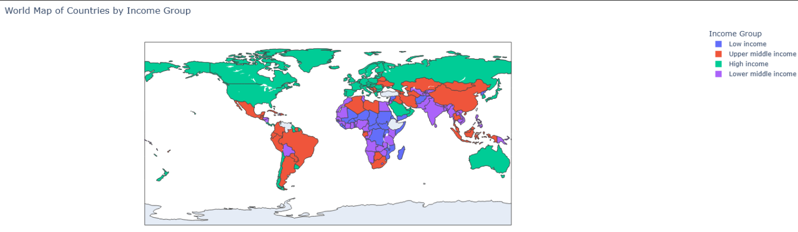
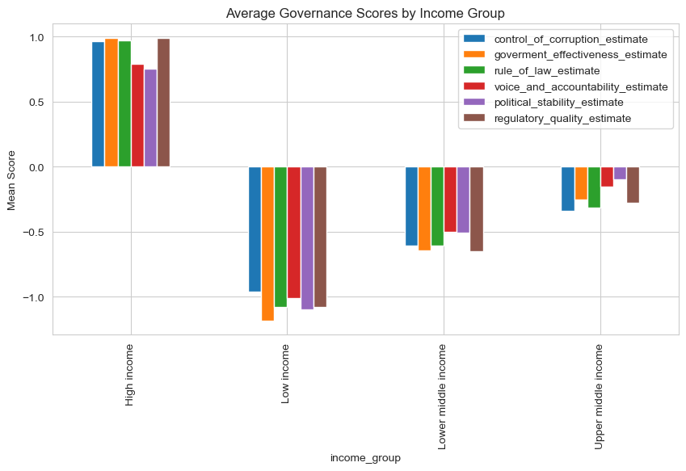
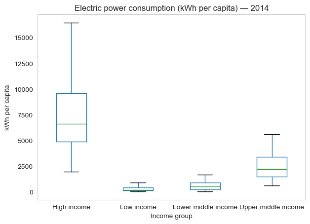
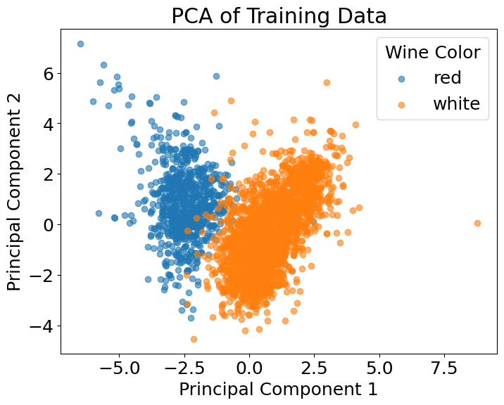
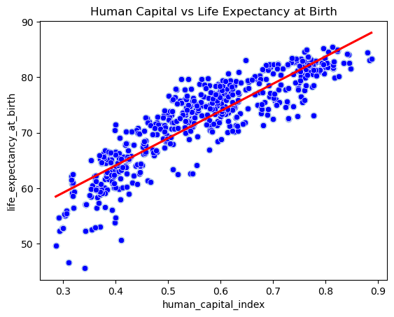

# World Bank Project Report

## 0. Authors of the report

| Name | Contribution |
|------|--------------|
| Shreyas Krishnamurthy     |              |
| Daniel Lichtmannecker     |              |
|  Tobias Demming    |              |
| Ranjit Singh     |              |

---

## 1. Dataset Overview

| Item | Description |
|------|-------------|
| Dataset name | World Bank Development Indicators Dataset |
| Number of rows | 13,728 |
| Number of columns | 52 |
| Format file (.csv, .txt, etc.) | .csv and .xlsx |
| Authors of the dataset | The World Bank |
| Source (name) | World Bank Open Data – World Development Indicators (WDI) |
| Source (link) | https://data.worldbank.org/ |
| Date/ Time | 17.11.2025, 17:30|

---

## 2. Dataset Structure

| Feature/variable | Data type | Description | Number of Unique values | Example values |
| ----------------------------------------- | ------------- | ------------------------------------------ | ----------------- | ------------------------------- |
| country                                   | object        | Name of the country                        | 215               | Afghanistan, Albania, Algeria   |
| region                                    | object        | Geographical region classification         | 7                 | Middle East, North Africa       |
| income_group                              | object        | World Bank income category                 | 4                 | Low income, Upper middle income |
| date                                      | object        | Year of recorded data                      | 64                | 1960-01-01, 1961-01-01          |
| agricultural_land%                        | float64       | % of land used for agriculture             | 7916              | 57.87, 57.95, 58.03             |
| forest_land%                              | float64       | % of land covered by forest                | 5107              | 1.85, 28.78                     |
| land_area                                 | float64       | Total land area (sq km)                    | 735               | 652230, 27400                   |
| avg_precipitation                         | float64       | Average annual rainfall (mm)               | 179               | 327, 1485                       |
| trade_in_services%                        | float64       | Trade in services as % of GDP              | 6959              | 5.94, 4.92                      |
| control_of_corruption_estimate            | float64       | Governance: corruption control score       | 4558              | -1.29, -1.17                    |
| control_of_corruption_std                 | float64       | Standard error for corruption estimate     | 2614              | 0.34, 0.32                      |
| access_to_electricity%                    | float64       | Population with electricity access (%)     | 3172              | 4.44, 9.29                      |
| renewvable_energy_consumption%            | float64       | Renewable energy consumption (%)           | 3926              | 23.0, 23.69                     |
| electric_power_consumption                | float64       | Electricity use (kWh per capita)           | 5771              | 532.02, 568.40                  |
| CO2_emisions                              | float64       | CO₂ emissions (kilotons)                   | 5690              | 2046.87, 1941.37                |
| other_greenhouse_emisions                 | float64       | Other greenhouse gases (kt CO₂ equivalent) | 5827              | 11630.79, 11899.99              |
| population_density                        | float64       | People per square kilometer                | 11776             | 13.47, 13.75                    |
| inflation_annual%                         | float64       | Annual inflation rate (%)                  | 8475              | 12.68, 6.78                     |
| real_interest_rate                        | float64       | Real interest rate (%)                     | 4333              | 10.04, -3.58                    |
| risk_premium_on_lending                   | float64       | Lending risk premium (%)                   | 2236              | 9.69, 6.18                      |
| research_and_development_expenditure%     | float64       | R&D expenditure (% of GDP)                 | 2198              | 0.08, 0.15                      |
| central_goverment_debt%                   | float64       | Government debt (% of GDP)                 | 1834              | 35.75, 37.48                    |
| tax_revenue%                              | float64       | Tax revenue (% of GDP)                     | 4262              | 6.96, 5.28                      |
| expense%                                  | float64       | Government expenditure (% of GDP)          | 4070              | 20.57, 24.24                    |
| goverment_effectiveness_estimate          | float64       | Governance effectiveness score             | 4457              | -2.17, -2.10                    |
| goverment_effectiveness_std               | float64       | Standard error for effectiveness score     | 1734              | 0.18, 0.30                      |
| human_capital_index                       | float64       | Human capital development index            | 568               | 0.389, 0.393                    |
| doing_business                            | float64       | Ease of Doing Business rank                | 186               | 173, 82                         |
| time_to_get_operation_license             | float64       | Days to get an operation license           | 243               | 13.8, 13.7                      |
| statistical_performance_indicators        | float64       | Data/statistics performance index          | 1211              | 37.22, 42.57                    |
| individuals_using_internet%               | float64       | Internet usage (% of population)           | 4608              | 0.00, 0.0047                    |
| logistic_performance_index                | float64       | Logistics quality index                    | 522               | 1.21, 2.24                      |
| military_expenditure%                     | float64       | Military spending (% of GDP)               | 7420              | 1.62, 1.86                      |
| GDP_current_US                            | float64       | GDP (current US dollars)                   | 10327             | 537M, 548M                      |
| political_stability_estimate              | float64       | Political stability score                  | 4590              | -2.41, -2.42                    |
| political_stability_std                   | float64       | Standard error for stability               | 609               | 0.47, 0.43                      |
| rule_of_law_estimate                      | float64       | Rule of law score                          | 4671              | -1.78, -1.73                    |
| rule_of_law_std                           | float64       | Standard error for rule of law             | 2631              | 0.35, 0.32                      |
| regulatory_quality_estimate               | float64       | Regulatory quality score                   | 4574              | -2.09, -2.06                    |
| regulatory_quality_std                    | float64       | Standard error for regulatory quality      | 1625              | 0.38, 0.44                      |
| government_expenditure_on_education%      | float64       | Govt. education spending (% of GDP)        | 4848              | 1.16, 1.11                      |
| government_health_expenditure%            | float64       | Govt. health spending (% of GDP)           | 3866              | 0.08, 0.65                      |
| multidimensional_poverty_headcount_ratio% | float64       | People in multidimensional poverty (%)     | 264               | 51.7, 49.4                      |
| gini_index                                | float64       | Income inequality index                    | 369               | 27.0, 31.7                      |
| birth_rate                                | float64       | Births per 1,000 people                    | 8745              | 50.34, 50.44                    |
| death_rate                                | float64       | Deaths per 1,000 people                    | 7374              | 31.92, 31.34                    |
| life_expectancy_at_birth                  | float64       | Life expectancy (years)                    | 11381             | 32.53, 33.06                    |
| population                                | float64       | Total population                           | 13403             | 8,622,466 ; 8,790,140           |
| rural_population                          | float64       | Rural population                           | 12750             | 7,898,093 ; 8,026,804           |
| voice_and_accountability_estimate         | float64       | Voice and accountability score             | 4719              | -1.90, -2.03                    |
| voice_and_accountability_std              | float64       | Standard error for voice & accountability  | 2504              | 0.26, 0.25                      |
| intentional_homicides                     | float64       | Intentional homicide rate                  | 3816              | 4.07, 3.48                      |

---

## 3. Data cleaning

| Issue | Names of Columns affected | Description of the Issue | Action Taken |
| -------------------------------- | ---------------------------------------------------------------- | --------------------------------------------------------------------------------------------- | ----------------------------------------------------------------------- |
| **Inconsistent column labeling** | `agricultural_land%`, `forest_land%`, `trade_in_services%`, etc. | Column names contain `%`, spaces, uppercase/lowercase inconsistency                           | Convert to lowercase, replace `%` with `_perc`, replace spaces with `_` |
| **Wrong data types**             | `date`, many numeric columns                                     | Some numeric columns are stored as **object** because of special characters or missing values | Convert using `pd.to_numeric(..., errors="coerce")`                     |
| **Missing values**               | Most indicator columns (ex: CO2, education, land data etc.)      | Missing values due to unavailable country–year data                                           | Handle using median/mode OR keep NaN depending on analysis              |
| **Duplicates**                   | Entire rows                                                      | Your dataset **has duplicates** (because many indicators repeat in the Excel file)            | Remove using `df.drop_duplicates()`                                     |
| **Inconsistent categories**      | `region`, `income_group`, `country`                              | Some values contain trailing spaces or inconsistent case                                      | Normalize using strip(), title()                                        |
| **Other issues**                 | Outliers in numeric indicators                                   | Extremely high values for indicators (e.g., CO2, GDP)                                         | Use IQR filtering before analysis                                       |

---

## 4. Descriptive statistics

### Numeric columns

|  | agricultural_land% | forest_land% | land_area | avg_precipitation | trade_in_services% | control_of_corruption_estimate | control_of_corruption_std | access_to_electricity% | renewable_energy_consumption% | electric_power_consumption | CO2_emisions | other_greenhouse_emisions | population_density | inflation_annual% | real_interest_rate | risk_premium_on_lending | research_and_development_expenditure% | central_government_debt% | tax_revenue% | expense% | government_effectiveness_estimate | government_effectiveness_std | human_capital_index | doing_business | time_to_get_operation_license | statistical_performance_indicators | individuals_using_internet% | logistic_performance_index | military_expenditure% | GDP_current_US | political_stability_estimate | political_stability_std | rule_of_law_estimate | rule_of_law_std | regulatory_quality_estimate | regulatory_quality_std | government_expenditure_on_education% | government_health_expenditure% | multidimensional_poverty_headcount_ratio% | gini_index | birth_rate | death_rate | life_expectancy_at_birth | population | rural_population | voice_and_accountability_estimate | voice_and_accountability_std | intentional_homicides |
|-----------|----------------------|---------------|-----------|--------------------|----------------------|----------------------------------|----------------------------|--------------------------|--------------------------------|------------------------------|---------------|-----------------------------|----------------------|------------------|---------------------|---------------------------|-----------------------------------------|-----------------------------|----------------|----------|-------------------------------------|------------------------------|---------------------|----------------|-------------------------------|----------------------------------------|-------------------------------|---------------------------|---------------------------|----------------|-------------------------------|------------------------|-----------------------|----------------|------------------------------|-------------------------|------------------------------------------|--------------------------------|-------------------------------------------|------------|------------|------------|----------------------------|------------|-------------------|----------------------------------|------------------------------|------------------------|
| Count | 11603.0 | 6564.0 | 11819.0 | 9938.0 | 6959.0 | 4711.0 | 4711.0 | 6025.0 | 6495.0 | 5771.0 | 5827.0 | 5827.0 | 11790.0 | 8475.0 | 4333.0 | 2326.0 | 2215.0 | 1834.0 | 4262.0 | 4070.0 | 4687.0 | 4687.0 | 590.0 | 186.0 | 317.0 | 1216.0 | 6410.0 | 1052.0 | 7421.0 | 10334.0 | 4748.0 | 4748.0 | 4801.0 | 4801.0 | 4689.0 | 4689.0 | 4862.0 | 3867.0 | 433.0 | 2077.0 | 12875.0 | 12857.0 | 12704.0 | 13452.0 | 13326.0 | 4778.0 | 4778.0 | 3906.0 |
| Mean | 36.9181 | 32.5347 | 599713.3 | 1206.377 | 24.02526 | -0.01305674 | 0.2043009 | 81.48462 | 30.25006 | 3227.134 | 141818.8 | 196268.7 | 355.2848 | 23.54963 | 5.496715 | 5.947804 | 0.9585865 | 59.26231 | 17.04154 | 26.87002 | -0.01727156 | 0.2418754 | 0.5687208 | 95.23118 | 30.94637 | 64.16242 | 25.43025 | 2.871117 | 2.71343 | 1.9307e11 | -0.01214663 | 0.2782072 | -0.01178117 | 0.2051687 | -0.01232792 | 0.2357293 | 4.353138 | 3.293354 | 26.85581 | 37.75156 | 27.85667 | 10.33237 | 64.75519 | 2.455672e07 | 1.328865e07 | -0.003927708 | 0.1676239 | 7.89184 |
| Standard Deviation | 22.53815 | 24.98562 | 1.6482e06 | 812.4004 | 25.64015 | 1.002079 | 0.08792732 | 29.29013 | 30.51117 | 4474.351 | 660171.5 | 809596.8 | 1678.125 | 328.4697 | 15.64945 | 7.196397 | 0.965499 | 71.47462 | 7.741642 | 12.78108 | 0.9973667 | 0.07383445 | 0.1454045 | 54.61586 | 29.8445 | 17.6691 | 30.76522 | 0.5902823 | 3.20769 | 1.04211e12 | 0.9981118 | 0.07710407 | 0.9944256 | 0.1027156 | 0.9928449 | 0.0747249 | 1.962049 | 2.340685 | 10.70612 | 8.853044 | 13.09258 | 5.531059 | 11.27735 | 1.049265e08 | 6.8962e07 | 0.995416 | 0.06444571 | 12.0817 |
| Min | 0.2628205 | 0 | 2.027 | 18.1 | 0.6210249 | -1.936706 | 0.1140622 | 0.5338985 | 0 | 5.548906 | 0 | 7.616981 | 0.09862452 | -17.64042 | -97.69348 | -31.50295 | 0.00544 | -1.170726 | 0.00005886437 | 0.0001254962 | -2.439963 | 0.1617789 | 0.2860746 | 1 | 1.2 | 11.76958 | 0 | 1.21 | 0.00001715 | 8.824744e06 | -3.312951 | 0.1922474 | -2.590877 | 0.1248018 | -2.547726 | 0.1464676 | 0 | 0.06221094 | 2.37 | 20.7 | 5 | 0.795 | 11.995 | 2646 | 0 | -2.313395 | 0.102437 | 0 |
| 25% | 17.13376 | 10.89666 | 10010 | 589 | 9.801673 | -0.7882849 | 0.1483999 | 71.51531 | 3.2 | 423.526 | 1398.665 | 6357.856 | 19.62627 | 2.114736 | 1.7489 | 2.571854 | 0.237175 | 30.80851 | 11.97707 | 17.14076 | -0.7568678 | 0.1994909 | 0.4438052 | 48.25 | 13.2 | 52.3675 | 0.1996449 | 2.42771 | 1.182027 | 1.452321e09 | -0.6520113 | 0.2281738 | -0.7951313 | 0.1523012 | -0.7235907 | 0.1887677 | 3.033689 | 1.536648 | 18.5 | 31.2 | 15.9 | 6.782 | 57.693 | 4.527332e05 | 1.70297e05 | -0.8049931 | 0.1267586 | 1.275797 |
| 50% | 37.94969 | 30.56444 | 96800 | 1083 | 16.31053 | -0.2317456 | 0.1728511 | 99.29801 | 18.73 | 1620.387 | 8690.27 | 26414.28 | 66.75049 | 4.827889 | 5.533671 | 4.614167 | 0.58741 | 49.43651 | 16.49875 | 25.53082 | -0.1551568 | 0.2187656 | 0.5718645 | 95.5 | 21.9 | 63.82396 | 8.299289 | 2.738342 | 1.88021 | 7.75068e09 | 0.08131517 | 0.2500757 | -0.1455695 | 0.1680377 | -0.1242432 | 0.2128689 | 4.201924 | 2.689868 | 24.8 | 35.6 | 26.3 | 9 | 67.5715 | 4.082205e06 | 1.674933e06 | 0.04354479 | 0.1425266 | 3.119286 |
| 75% | 54.93074 | 51.84505 | 452860 | 1738 | 28.13833 | 0.688829 | 0.2270555 | 100 | 52.825 | 4401.124 | 57238.35 | 88654.71 | 164.528 | 10.12478 | 9.772952 | 7.249583 | 1.370595 | 73.88354 | 21.55998 | 34.52769 | 0.6881842 | 0.2547196 | 0.6899059 | 141.75 | 37.3 | 79.26896 | 47.895 | 3.28 | 3.16077 | 5.297466e10 | 0.8398256 | 0.3081053 | 0.8018623 | 0.2092258 | 0.7341218 | 0.2596417 | 5.382903 | 4.560446 | 32.6 | 43 | 39.6425 | 12.24179 | 73.05141 | 1.267987e07 | 6.971399e06 | 0.9020221 | 0.1972829 | 9.165553 |
| Max | 93.44075 | 98.57455 | 1.638995e07 | 3240 | 327.1662 | 2.459118 | 0.9425017 | 100 | 98.34 | 54799.17 | 1.094469e07 | 1.294287e07 | 21594.8 | 23773.13 | 628.3197 | 67.84154 | 5.70555 | 2002.51 | 147.6402 | 210.2051 | 2.46966 | 0.8816406 | 0.8870836 | 190 | 176.1 | 93.63583 | 100 | 4.3 | 117.3498 | 2.54397e13 | 1.964211 | 0.6648169 | 2.124782 | 0.8328816 | 2.252235 | 0.8915332 | 44.33398 | 22.25426 | 74.2 | 65.8 | 58.121 | 103.534 | 85.49756 | 1.417173e09 | 9.093848e08 | 1.800992 | 0.5785477 | 138.774 |

### Category columns

|                 | country     | region                | income_group | date       |
|--------------------------|-------------|------------------------|--------------|------------|
| Count                    | 13727       | 13727                 | 13727        | 13727      |
| Number of unique values  | 215         | 7                      | 4            | 64         |
| Most frequent value      | Afghanistan | Europe & Central Asia | High income  | 1990-01-01 |
| Most frequent frequency  | 64          | 3712                   | 5504         | 215        |
| Least frequent value     | Vietnam     | North America          | Low income   | 2023-01-01 |
| Least frequent frequency | 31          | 192                    | 1600         | 214        |

## 5. Analysis – Research question

*World Map: Countries by Income Group*

### Governance and institutional quality (Shreyas)

*Correlation Table of governance indicators*

The correlation heatmap shows that all six governance indicators are very strongly and positively correlated with each other (mostly above 0.9). Countries that score well on rule of law also tend to score highly on government effectiveness, regulatory quality and control of corruption. Even the lowest correlations, involving political stability and voice and accountability, remain high. This suggests that governance quality tends to move as a single underlying dimension rather than as independent aspects.

*Pairplot for different governance indicators*

The pairwise scatter plots confirm these strong positive relationships. For every pair of governance indicators, the points form tight upward-sloping clouds, indicating almost linear associations. When coloured by income group, clear patterns emerge:

High-income countries are clustered in the upper-right corner (strong governance across all dimensions).

Low-income countries cluster in the lower-left area with systematically weaker scores.

The kernel density plots along the diagonal show well-separated distributions: high-income countries have much higher average governance scores, while low-income countries are heavily concentrated at the lower end.

*Barplots for average governance scores by income group*

The bar chart compares average governance scores across income groups for all six indicators. High-income countries consistently achieve the highest values, with all indicators well above zero. The pattern is clear: governance quality declines steadily with income level, and the distance between low-income and high-income countries is seen across every measure.

**Conclusion:**

The results indicate that governance indicators capture a common underlying concept of institutional quality and are tightly linked to a country’s income level. Higher-income countries systematically exhibit stronger control of corruption, more effective governments, better regulatory quality, stronger rule of law, greater political stability and more voice and accountability. Lower-income countries tend to combine weaker performance across all these dimensions. This pattern suggests that economic development and institutional quality reinforce each other and that governance gaps mirror broader global income inequalities.

### Environmental sustainability (Tobias)

*CO2 per capita over time*

The line chart shows that CO₂ emissions per capita are consistently highest in high-income countries and lowest in low-income countries. However, in recent years we see a slow decline for high income countries which might indicate that recent sustainability regulations in high income countries show effects.

*Boxplot: Electric power consumption 2014*

The 2014 boxplot highlights the extreme inequality in electricity use: high-income countries consume vastly more electricity per person, with a wide range of values, whereas all lower-income groups cluster at very modest levels.

*Electric power consumption over time*

The long-term trends reveal a large and widening gap in electricity consumption between income levels. High-income countries experience a strong and steady increase over time, while the three lower income groups remain at much lower and relatively flat consumption levels.

**Conclusion:**

Across all indicators, environmental resource use scales strongly with income. High-income countries consume far more electricity and generate substantially higher CO₂ emissions per capita, while lower-income countries use much less energy and emit far less carbon. Although lower-income regions contribute least to global environmental pressure, they remain the most vulnerable to environmental risks and have the least access to energy resources, highlighting persistent global disparities in environmental sustainability.

### Economic performance and poverty reduction (Ranjit)

*GDP per Capita Across Income Groups*

The boxplot shows clear differences in GDP per capita across income groups. High-income countries have by far the highest levels and widest spread, while low-income countries remain clustered at very low values. 

The violin plots display the distribution of income inequality within each income group. Statistical tests did not show significant differences between all the groups here.

*Mean Health & Education Expenditure by Income Group*

The grouped bar chart compares average government spending on health and education. High-income countries allocate considerably more resources to both sectors, whereas low-income countries spend only a small fraction in comparison.

**Conclusion:**

Economic indicators show strong and persistent disparities between income groups. High-income countries consistently outperform other groups across GDP per capita, social spending, and income equality. Upper-middle-income countries have made progress but still face higher inequality and lower investment in public services. Low-income countries remain at a structural disadvantage, with limited fiscal capacity and lo

### Human well-being and health (Daniel)

**1. Life Expectancy at birth**

*Boxplot: Life expectancy at birth (2021)*

The box plot shows life expectancy in the four global income groups for the year 2021. The graph clearly shows that life expectancy increases systematically with rising income.

*Barplot with confidence intervals (2021)*

The bar chart plot shows the average life expectancy per income group in 2021, supplemented by 95% confidence intervals. The differences that were visible in the box plot are statistically confirmed here.

*Life expectancy 1960 - 2021*

This graph shows the long-term development of life expectancy over more than 60 years.
All income groups are recording rising values, but at very different levels. The gap between the groups has persisted for decades – an indication of continuing global inequalities in health.

**Conclusion:**

The results clearly show that countries with higher incomes consistently perform better. As early as 2021, there is a clear gap between the groups, which is visible in both the box plots and the confidence intervals. It is particularly striking that high-income countries not only achieve higher life expectancies, but also show lower dispersion, indicating more stable living conditions and more reliable health systems. The data underscores that global health inequalities are very closely linked to a country's economic resources. The analysis clearly shows that development and health policies must focus particularly on countries that are structurally disadvantaged due to low income.

**2. Access to electricity**

*Boxplot: Access to electricity in 2021 by income group*

The boxplot shows substantial differences in access to electricity across income groups in 2021. High-income and upper-middle-income countries have nearly universal access, with very limited variation. Low Income countries have way lower values and higher variance. Electricity access increases systematically with income level.

*World maps: Country-level access in 2000 and 2021*

The two world maps compare access to electricity in 2000 and 2021. In 2000, large parts of Sub-Saharan Africa and parts of South Asia had very low access levels, while high-income regions were already fully electrified. By 2021, many regions show substantial improvements, especially in lower-middle-income countries. However, severe gaps remain in several low-income countries, where access has improved but still lags far behind the rest of the world. The maps highlight both global progress and persistent regional inequalities.

*Time series: Mean access to electricity by income group (1960–2021)*

The time-series plot shows consistent long-term improvements in all income groups, but at very different levels. High-income countries reached near-universal access decades ago and remain stable. Upper-middle-income countries show steady growth and approach full coverage. Lower-middle-income countries improve gradually from low starting values. Low-income countries start from extremely low access and increase only slowly, maintaining a wide gap relative to all other groups.

**Conclusion:**
Access to electricity is strongly associated with national income levels. High-income and upper-middle-income countries have reached near-universal access, while lower-middle-income countries show improving but uneven progress. Low-income countries remain significantly behind, with large portions of the population still lacking reliable access.

3. Government expenditure on education
- Anova shows only significant difference for some income groups -> no clear pattern here!

---

## 6. AI Disclaimer

We used AI for some code for running statistical tests like the Anova and for some complex visualizations.

