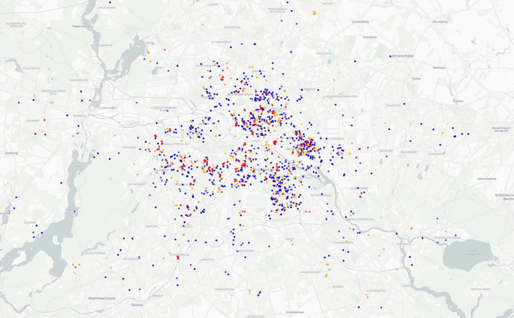
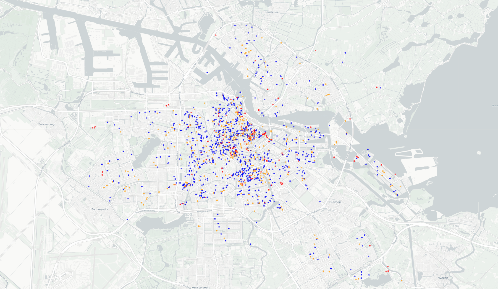
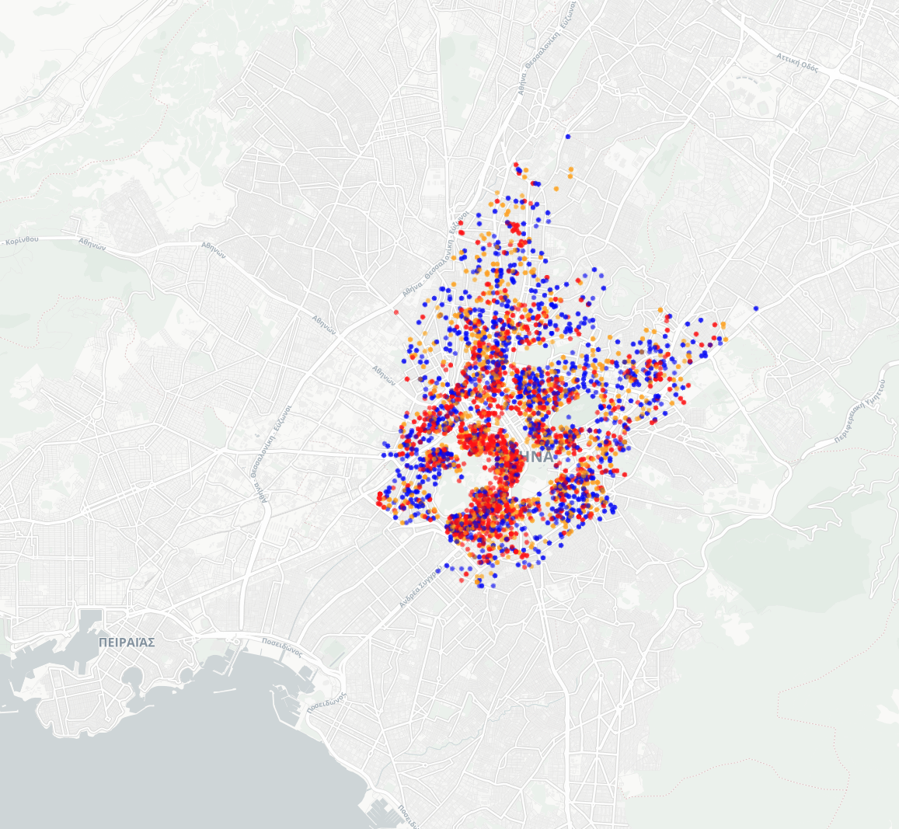
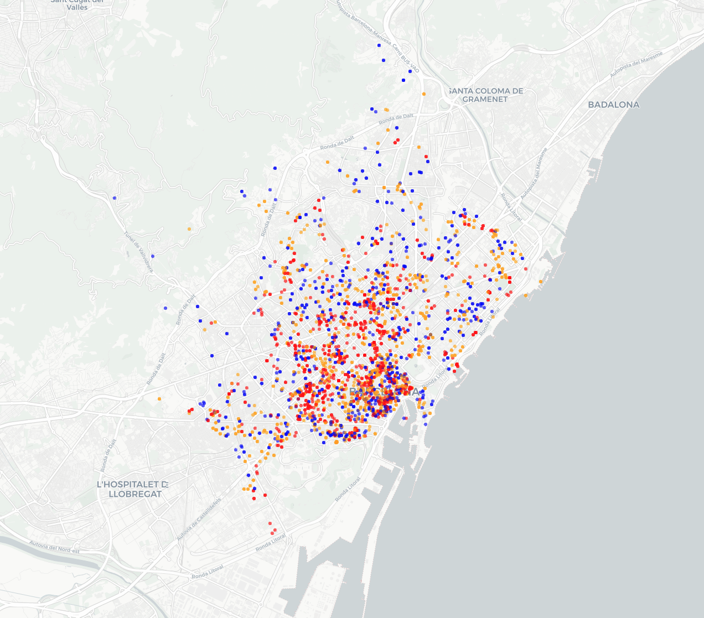
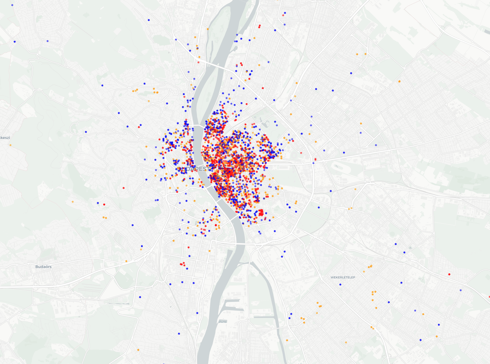
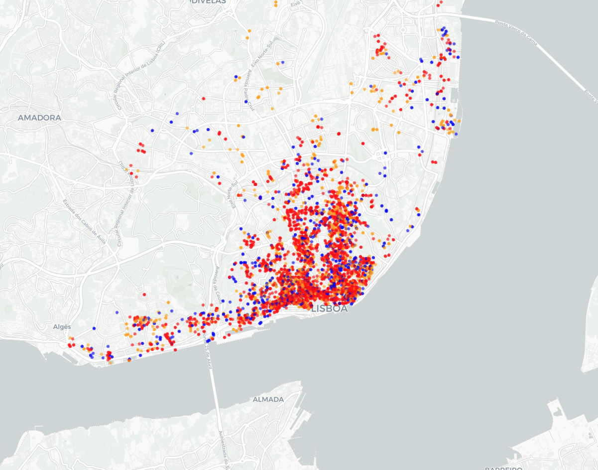
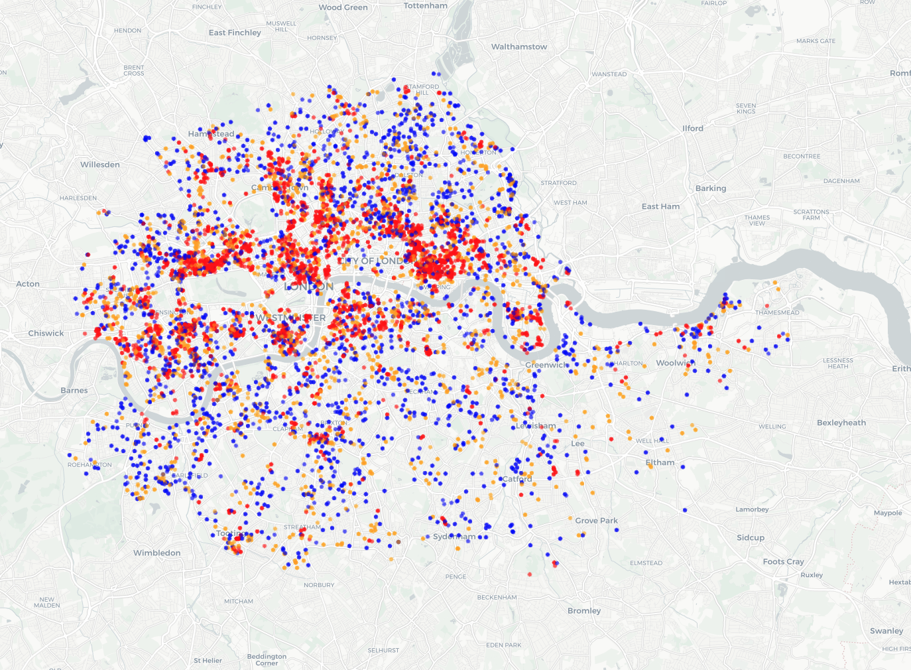
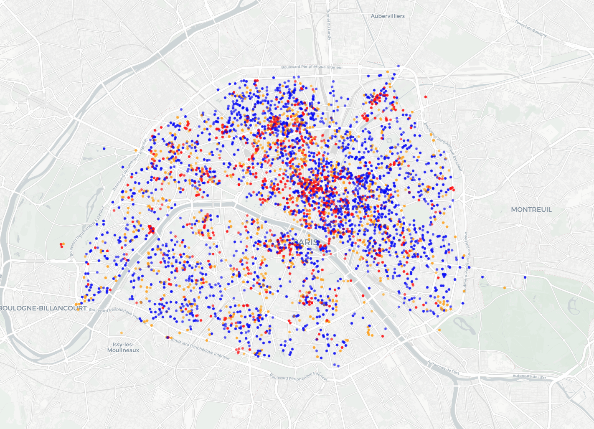
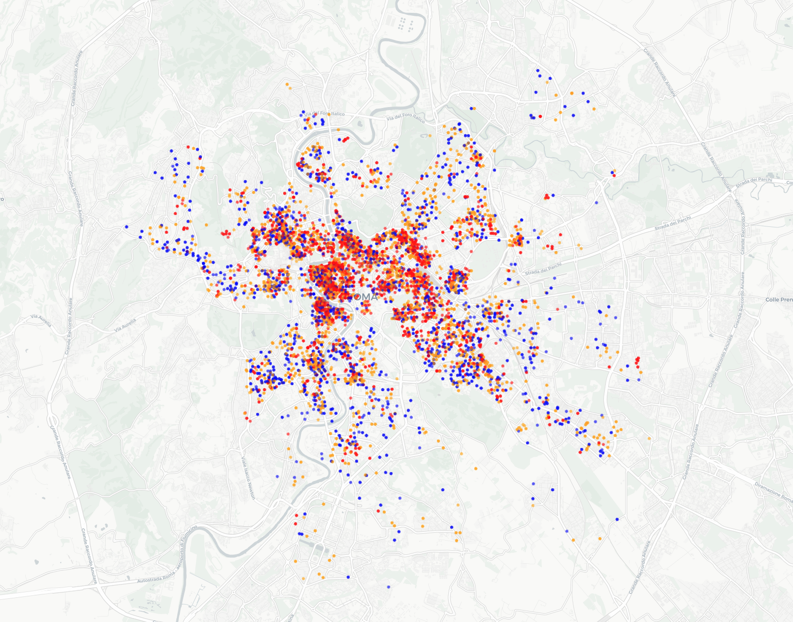
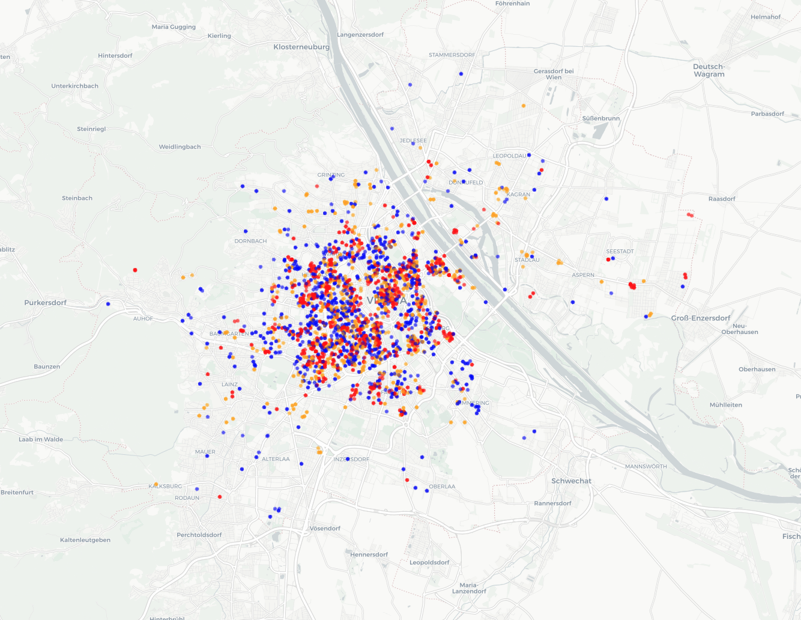

# Airbnb Report Group 1

## Authors of the report

| Name | Contribution |
| :---- | :---- |
| Shreyas Krishnamurthy | Dataset Overview, Dataset Structure, Descriptive statistics, Notebook questions   |
|Daniel Lichtmannecker  | Data Cleaning, Notebook questions, group report   |
| Tobias Demming | Data Cleaning, Notebook questions, group report   |
| Ranjit Singh |  Data Cleaning, Notebook questions, group report  |
|  |   |

## Final Dataset Overview

| Item | Description |
| :---- | :---- |
| Dataset name | Airbnb European Cities Dataset |
| Number of rows | 51707  |
| Number of columns | 19  |
| Format file (.csv, .txt, etc) |.csv |
| Authors of the dataset | Original Data Scraped by AirDNA (A commercial data provider), authors of the final dataset are equivalent to the authors of the report  |
| Source (name) | airbnb_final  |
| Source (link) | [here](../additional_material/airbnb_group1.csv) |
| Date/Time| 10.11.2025, 21:30 |

   
   
## Dataset Structure

| Feature/variable | Data type | Description | Number of Unique values | Example values |
| :---- | :---- | :---- | :---- | :---- |
| Price   | float64  | The final price for the booking (typically a two-night stay for two guests) in Euros (€).  | 10497  | 194.0336981  |
| room_type      | object (String)  | The type of space offered: 'Entire home/apt', 'Private room', or 'Shared room'.  | 3  | Private room  |
| person_capacity   | float64  | The maximum number of guests the listing can accommodate.  | 5  | 2  |
| host_is_superhost  | bool  | True if the host has Superhost status, False otherwise.  | 2  | False  |
| cleanliness_rating   | int64  | The listing's cleanliness rating score, typically on a 5-10 scale.  | 9  | 10  |
| guest_satisfaction_overall  | int64  | The overall guest satisfaction rating, typically on a 0-100 scale.  | 51707  | 53  |
| bedrooms   | float64  | The number of bedrooms in the listing (e.g, 0 for studio apartments).  | 51707  | 10  |
| dist  | float64  | The distance from the listing to the city center (units depend on the source, often kilometers).  | 51707  | 5.02 |
| metro_dist  | float64  | The distance from the listing to the nearest metro/subway station.  | 51707  | 2.54  |
| attr_index   | float64  | Attraction Index: A raw score reflecting the attractiveness (cultural, historical sites) of the area.  | 51707   | 78.69  |
| attr_index_norm  | float64  | The Normalized Attraction Index, scaled to a 0-100 range.  | 51688  | 4.17  |
| rest_index     | float64  | Restaurant Index: A raw score reflecting the availability of dining options in the vicinity.  | 51707  | 98.25  |
| rest_index_norm     | float64  | The Normalized Restaurant Index, scaled to a 0-100 range.  | 51688  | 6.85  |
| lng    | float64  | Geographical coordinates (Longitude).  | 23600  | 4.91  |
| lat  | float64  | Geographical coordinates (Latitude).  | 21484  | 52.42  |
| city     | object (String)  | The European city where the listing is located.  | 10  | london  |
| day_type    | object (String)  | Categorization of the booking period: 'weekdays' or 'weekends'.  | 2  | weekend  |
| country  | object (String)  | The country where the city is located (newly engineered column).  | 10  | France  |
| host portfolio  | object (String)  | How many listings each host has (newly engineered column).  | 3  | one, two_to_four, more_than_four  |
 

## Data cleaning

We deleted the dummy variables "room_shared", "room_private", "multi", "biz", as their information was redundant. 

We created new columns "city", "days", "country", "host_portfolio" for better analysis of the data.

We did some other minor changes, like deleting the first column (which only numbered the listings) and renamed some variables ("realSum" -> "Price")

## Descriptive statistics

**Numeric columns**

|   | Price | person_capacity | cleanliness_rating | guest_satisfaction_overall  | bedrooms | dist | metro_dist | attr_index | attr_index_norm  | rest_index | rest_index_norm | lng | lat | log_Price |
| :---- | :---- | :---- | :---- | :---- | :---- | :---- | :---- | :---- | :---- | :---- | :---- | :---- | :---- | :---- |
| Mean | 279.88   | 3.16 | 9.39 | 92.63| 1.16 | 3.19  | 0.68   | 294.20  | 13.42 | 626.86  | 22.79   | 7.43    | 45.67    | 5.42  |
| Standard deviation | 327.95   | 1.30   | 0.95  |8.95   | 0.63    | 2.39| 0.86    | 224.76   | 9.81 |  497.92   | 17.80    |  9.80   |   5.25 |    0.59    |
| Min | 34.78    |  2.00  | 2.00  | 20.00  |    0.00   |   0.015 |    0.002 |  15.15  |     0.93   |  19.58  |     0.59   |  -9.23   |  37.95  |   3.58   |
| 25% | 148.75 |  2.00  | 9.00     | 90.00   |   1.00   |   1.45 |    0.25  |   136.80   |     6.30926   | 250.85  |     8.75  |  -0.07 |   41.40  |  5.01  | 
| 50% | 211.34  |  3.00  | 10.00     |     95.00    |  1.00   |   2.61  |    0.41  |  234.33    |   11.47  |  522.05  |     17.54  |   4.87   | 47.51 |   5.36  |
| 75% | 319.69  |  4.00  | 10.00     |  99.00    |  1.00  |    4.26 |    0.74    |   385.76 |      17.41|  832.63   |     32.96 |   13.52   |  51.47   |   5.77   |
| Max | 18545.45  | 6.00  | 10.00     | 100.00   |  10.00  |   25.28  |   14.27  | 4513.56    |  100.00 |  6696.16 |     100.00  | 23.79 |   52.64|    9.83  |
   
**Category columns**

|   | room_type | City | days | country | host_portfolio |
| :---- | :---- | :---- | :---- | :---- | :---- |
| Number of unique values |3   | 10  |  2 |10 |3 |
| Most frequent value | Entire home/apt  |  london | weekends	 | United Kingdom | one |
| Most frequent value (frequency) | 32648  |  9993 |  26207 |9993 |18534  |

 

# 5. Research question: How do AirBnb flats aggravate the risk of gentrification in big european cities?

 Airbnb data can help us understand how short-term rentals affect life in European cities. In many places, the growth of Airbnb has been linked to rising rents and changes in local neighborhoods.These patterns are often connected to gentrification. Gentrification happens when wealthier people move into previously affordable areas, leading to higher housing costs and the displacement of long-term residents.

The aim of this report is to look for early patterns in Airbnb activity across ten European cities. By comparing prices, listing types, and host characteristics, we hope to spot possible signs of housing pressure or trends that could relate to gentrification.

## Analysis 1: Do Prices differ between cities?

This analysis looks at how Airbnb prices differ between European cities. Comparing price levels helps us understand where short-term rentals might be putting more pressure on local housing markets — something often linked to gentrification. High Airbnb prices can make it harder for locals to compete with tourist demand for housing.

*Figure 1: Airbnb prices across cities (outliers excluded). Higher median prices can point to stronger market pressure and higher demand for short-term rentals.*

The chart shows clear differences between cities. Amsterdam, London, and Paris stand out with noticeably higher prices and wider variation, suggesting stronger demand and possibly more tension in the local housing markets. In contrast, cities like Athens or Budapest have lower and more consistent prices, which may indicate a smaller Airbnb impact for now.

Still, we shouldn’t jump to conclusions. Prices alone don’t tell the full story because factors like income levels, cost of living, or housing availability are also important. To really understand gentrification risks, this data would need to be looked at together with broader economic and social information.

## Analysis 2: What are the dominant room types by city?
---
This analysis looks at the types of Airbnb listings available in each city. The goal is to see whether short-term rentals mostly consist of entire apartments or smaller spaces like private or shared rooms. This matters because a high share of entire homes and apartments often means that housing is being taken off the long-term market. This trend can contribute to gentrification and housing shortages.

*Figure 2: Share of different Airbnb room types per city. A higher share of entire homes or apartments can signal stronger housing pressure and less availability for local renters.*

Most cities show that entire homes or apartments make up the majority of listings, especially in cities like Athens, Budapest and Vienna. This suggests that Airbnb is being used more as a commercial rental platform rather than for occasional room sharing which is moving away from Airbnb’s original idea of sharing a spare room.

In contrast, Barcelona and Berlin have a noticeably higher share of private rooms, meaning a larger portion of listings still come from residents renting out part of their own homes.

There is a very low share of shared rooms in any city, with Berlin having the highest share.

From a gentrification perspective, cities with many entire-home listings may face greater housing pressure, since these apartments are effectively removed from the long-term rental market. 

## Analysis 3: Are the AirBnbs used privately or commercially?
---
This analysis looks at how many listings each host manages in different cities. This helps to see whether Airbnb is mainly used by private individuals or by professional hosts who run several apartments as a business. Understanding this balance is important because a high share of professional hosts can point to more commercial use of the platform, which may increase housing pressure.

*Figure 3: Distribution of host portfolios per city. A larger share of hosts with more than four listings suggests a more commercial use of Airbnb and a higher potential impact on local housing markets.*

The figure shows clear differences between cities. Especially in Lisbon, many hosts manage several apartments, while in cities such as Amsterdam or Berlin, more hosts have only one listing. A large number of multi-listing hosts means that Airbnb is not only used for occasional rentals but has become part of a business model focused on profit.

Cities with many hosts managing more than four listings may face higher risks related to gentrification. When apartments are rented out commercially instead of being available to residents, it can reduce the local housing supply and raise prices. 

## Analysis 4 – Distribution of host types across city: 
---
We showed that hosts with more that four properties are closer to the city center than hosts with only one property. We think this is because commercially operating hosts have pushed out private hosts from the city centers.
To visualize this we map each property in the city and display whether the host is private (1 flat), semi commercial (2-4 flats) or commercial (> 4 flats).

It is clearly visible in many cities, that the commercial properties tend to be closer to the city center. One could argue that this is a sign of gentrification, however this is highly speculative without any additional information of the housing marketing in the city in general.

**Color Schema:**
- Private:  Blue
- Semi commercial: Orange
- Commercial: Red

### Berlin

*Figure 4: Distribution of Host type in Berlin*

### Amsterdam

*Figure 5: Distribution of Host type in Amsterdam*

### Athens

*Figure 6: Distribution of Host type in Athens*

### Barcelona

*Figure 7: Distribution of Host type in Barcelona*

### Budapest

*Figure 8: Distribution of Host type in Budapest*

### Lisboa

*Figure 9: Distribution of Host type in Lisboa*

### London

*Figure 10: Distribution of Host type in London*

### Paris

*Figure 11: Distribution of Host type in Paris*

### Roma

*Figure 12: Distribution of Host type in Roma*

### Vienna

*Figure 13: Distribution of Host type in Vienna*

