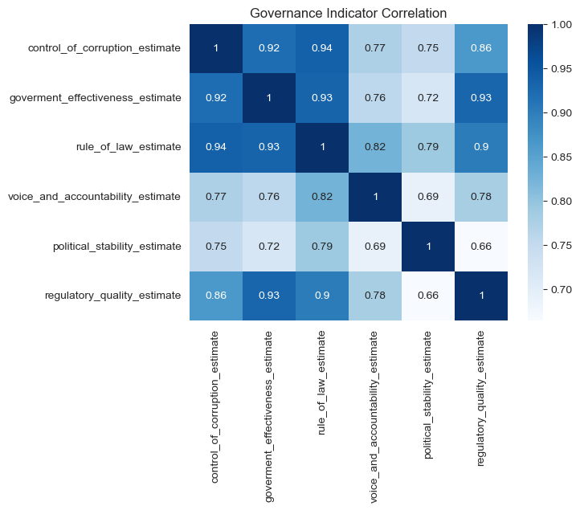
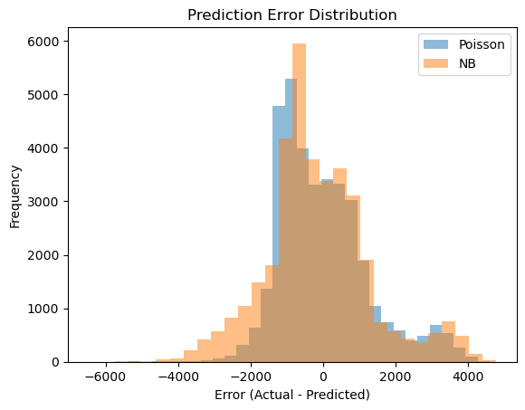

# World Bank Correlation Report

We extend the research from last week by now looking in-depth in different variables and seeing if they are correlated with each other. For that, we cluster the dataset into four different areas: 

- Governance and institutional quality (Shreyas)
- Environmental sustainability (Tobias)
- Economic performance and poverty reduction (Ranjit)
- Human well-being and health (Daniel)

**Table of Contents**:
 1. Introduction and research question
 2. Results

    2.1 Governance and institutional quality

    2.2 Environmental sustainability

    2.3 Economic performance and poverty reduction

    2.4 Human well-being and health

3. Conclusion

**Table of figures**:

**Figure 1**: Correlation Heat Map for governance and institutional quality

**Figure 2**: Scatter Plot Map for governance and institutional quality

**Figure 3**: Correlation Heat Map for environmental sustainabilty

**Figure 4**: Scatter Plot for gdp per capita vs. electric power consumption per capita

**Figure 5**: Correlation Heat map for economic performance and poverty reduction

**Figure 6**: Scatter Plot for Human Capital vs. Poverty

**Figure 7**: Scatter Plot for Human Capital vs. Life Expectancy at birth

**Figure 8**: Scatter Plot for Tax revenue vs. Expenses by government

**Figure 9**: Mixed plot for correlations of human well-being and health

**Figure 10**: Histogram and Boxplot for birth rate and GDP per capita

**Figure 11**: Scatter Plot for GDP per capita vs. birth rate

## 1. Introduction and research question

Understanding global development patterns requires more than looking at individual indicators in isolation. Many social, economic, environmental, and health-related phenomena are interconnected, and exploring the relationships between them can reveal important insights into how countries progress over time. By investigating correlations across different dimensions-such as governance, sustainability, economic performance, and human well-being-we aim to uncover whether consistent patterns exist and what these patterns might imply for global development and long-term sustainability.

This analysis is particularly relevant because identifying such relationships can help policymakers and organizations understand which areas reinforce each other, which variables move together, and where targeted interventions may have the greatest impact.

*Research Question*:

To what extent are key indicators across governance, environmental sustainability, economic performance, and human well-being correlated with each other, and what do these relationships reveal about broader global development patterns and pathways toward sustainability?

## 2. Results

In this chapter we will provide our results for the different categories.

### 2.1 Governance and institutional quality

**Hypothesis**: The variables in this area are all very intercorrelated.

*Figure 1: Correlation Heat Map for governance and institutional quality*

The results of Spearman Correlation Tests for each variable-pair are all significant. All of these variables are positively correlated, therefore the Hypothesis can be confirmed.

*Figure 2: Scatter Plot Map for governance and institutional quality*

This image shows a clear pattern. The high income countries are on the upper right end of each plot and low income countries are all on the low left side.

### 2.2 Environmental sustainability

**Overview over relevant variables:**

*Figure 3: Correlation Heat Map for environmental sustainabilty*

**Correlation**: GDP per capita vs. Electric Power Consumption

**Hypothesis**: Higher GDP per capita is correlated with higher Electric Power Consumption

*Figure 4: Scatter Plot for gdp per capita vs. electric power consumption per capita*

The scatter plot shows a clear positive relationship between electric power consumption and GDP per capita. The correlation is strong and statistically significant (*r = 0.69*, *p = 0.00*), indicating that countries with higher electricity use tend to have higher economic output.

However, this is only a correlation. It does not show whether electricity consumption drives economic growth, whether higher GDP increases energy use, or whether both are shaped by broader factors such as industrialization or infrastructure.

### 2.3 Economic performance and poverty reduction

**Overview over the relevant variables**:

*Figure 5: Correlation Heat map for economic performance and poverty reduction*

**Correlation 1**: Human Capital vs. Poverty

**Hypothesis**: Higher human capital is correlated with low poverty rates

*Figure 6: Scatter Plot for Human Capital vs. Poverty*

This is a negative correlation (*Spearman r ≈ -0.64, p-value = 0.00*) which tells as the human capital index increases, the poverty headcount decreases. It means  the countries with higher education, skills, and health levels (high human capital), tend to have much lower poverty rates.

**Correlation 2**: Human Capital vs. Life Expectancy at Birth

**Hypothesis**: Higher Human Capital correlates with higher Life Expecancy at Birth

*Figure 7: Scatter Plot for Human Capital vs. Life Expectancy at birth*

The results show a very strong positive correlation (*Spearman r ≈ 0.90, p-value = 0.00*) between Human Capital Index and Life Expectancy. It means countries with higher HCI (health, education, skills) tend to have higher life expectancy.

**Correlation 3**: Tax revenue vs. expenses

**Hypothesis**: Higher tax revenues (%) correlate with higher expeneses (%) by government

*Figure 8: Scatter Plot for Tax revenue vs. Expenses by government*

The results show a moderate positive correlation (*Spearman r ≈ 0.68, p-value 0.00*) between Tax Revenue and Government Expenses.This suggests that countries with higher tax revenue tend to also exhibit higher levels of government spending. 

### 2.4 Human well-being and health

**Overview over the relevant variables**:

*Figure 9: Mixed plot for correlations of human well-being and health*

**Descriptive statistics for Birth rate and GDP per Capita**

*Figure 10: Histogram and Boxplot for birth rate and GDP per capita*

**Hypothesis**: Higher GDP per Capita correlates with a lower birth rate

*Figure 11: Scatter Plot for GDP per capita vs. birth rate*

The results show a negative correlation (*Spearman r ≈ -0.82, p-value 0.00*) between Birth Rate and GDP per Capita.This suggests that countries with a higher GDP per Capita tend to have lower birth rates.

## 3. Conclusion

The analysis shows several clear relationships between important development indicators. Countries with a higher GDP per capita usually use more electric power and have lower birth rates, which fits the idea that richer countries go through a demographic transition. We also found that countries with higher human capital tend to have lower poverty rates and higher life expectancy, suggesting that education and skills are closely linked to better living conditions. In addition, higher tax revenues are linked to higher government spending, which can point to stronger public finances.

Overall, these results show that many development indicators move in the same direction: stronger economies often have better infrastructure, healthier populations, and more resources for public investment. While we cannot conclude that one factor directly causes another, the correlations highlight how different aspects of development are connected and shape a country's path toward sustainability.

AI-Disclaimer: We used AI for helping us with the code for more complex visualizations.

