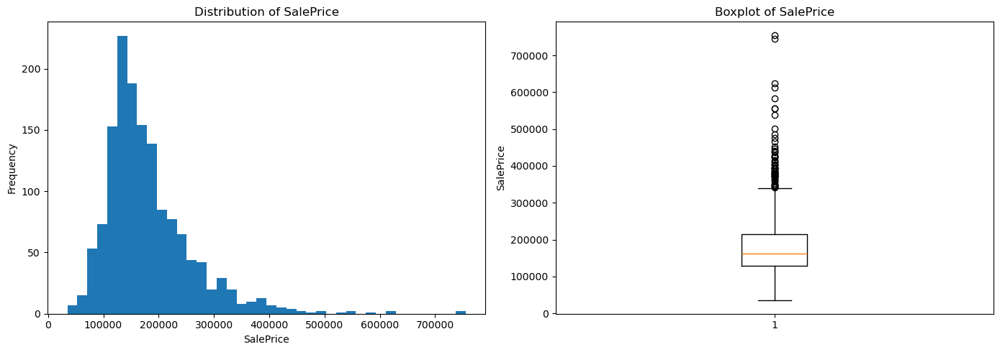
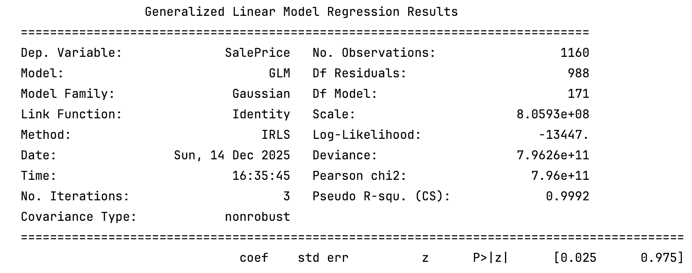
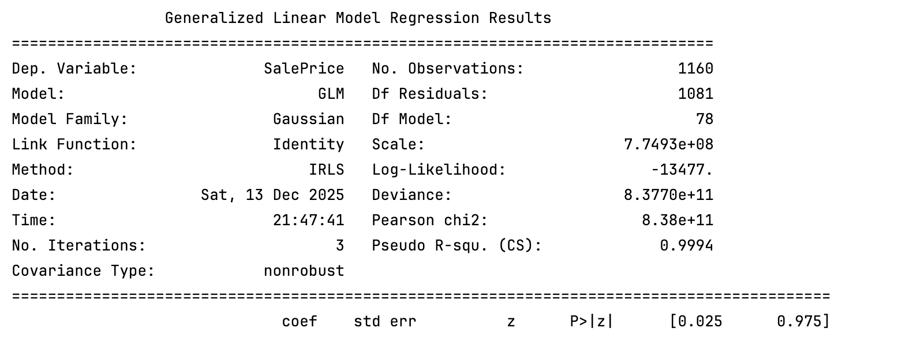
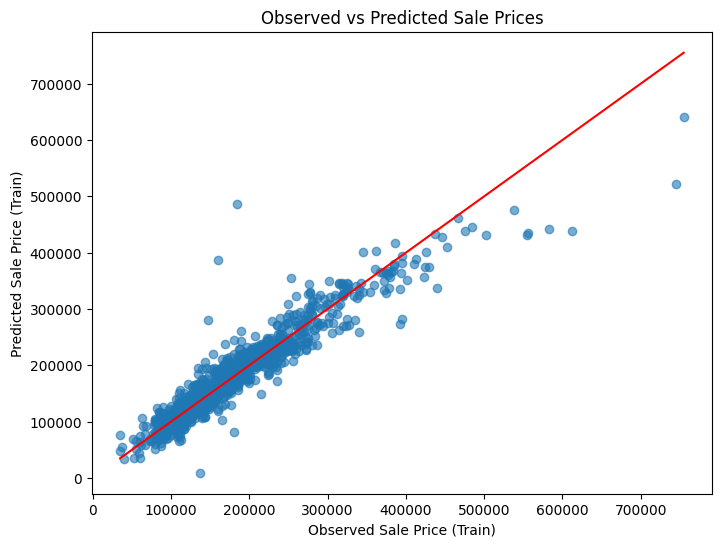
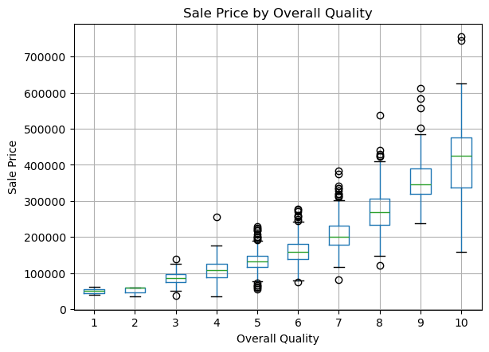
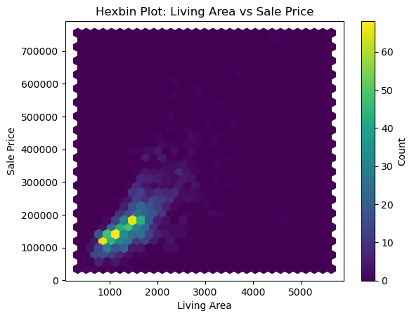
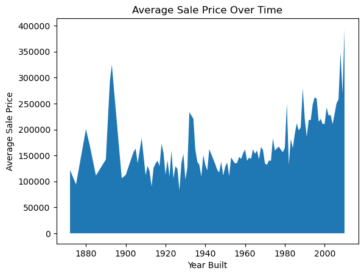

# Ames Housing Dataset Analysis Project Report 

## 0. Authors of the report

| Name | Contribution |
|------|--------------|
| Shreyas Krishnamurthy     |         |
| Daniel Lichtmannecker     |         |
|  Tobias Demming    |       |
| Ranjit Singh     |        |

## 1. Dataset Overview

Numbers refer to the cleaned version of the dataset used for the model.

| Item                | Description                                                                                                                                                                   |
|---------------------|-------------------------------------------------------------------------------------------------------------------------------------------------------------------------------|
| Number of rows      | 1451                                                                                                                                                                          |
| Number of columns   | 54                                                                                                                                                                            |
| Format file (.csv, .txt, etc) | .xlsx                                                                                                                                                                         |
| Creator of the dataset | Same as the authors of the report                                                                                                                                             |
| Source (name)       | Group1_housing                                                                                                                                                                |
| Source (link)       | [Final Dataset: Group1_housing.xlsx](https://github.com/Titaniel3/ASDA_2025_Group_1_Portfolio_new/blob/946ccaf3793ff42cff3cadaaad3cd2b67103d568/datasets/Group1_housing.xlsx) 
| Date/Time | 14.12.2025/ 01.03 pm                                                                                                                                                          |

## 2. Dataset Structure

| Feature / Variable | Data type | Description                                 | Number of unique values | Example values              |
| ------------------ | --------- | ------------------------------------------- | ----------------------- | --------------------------- |
| LotFrontage        | int64     | Linear feet of street connected to property | 111                     | [65, 80, 68]                |
| LotArea            | int64     | Lot size in square feet                     | 1066                    | [8450, 9600, 11250]         |
| LotShape           | object    | General shape of property                   | 4                       | [Reg, IR1, IR2]             |
| LandContour        | object    | Flatness of the property                    | 4                       | [Lvl, Bnk, HLS]             |
| Neighborhood       | object    | Physical locations within Ames city limits  | 25                      | [CollgCr, Veenker, Crawfor] |
| Condition1         | object    | Proximity to various conditions             | 9                       | [Norm, Feedr, Artery]       |
| HouseStyle         | object    | Style of dwelling                           | 8                       | [2Story, 1Story, 1.5Fin]    |
| OverallQual        | int64     | Overall material and finish quality (1–10)  | 10                      | [7, 6, 8]                   |
| OverallCond        | int64     | Overall condition of the house (1–10)       | 9                       | [5, 8, 6]                   |
| YearBuilt          | int64     | Original construction date                  | 112                     | [2003, 1976, 2001]          |
| YearRemodAdd       | int64     | Remodel date                                | 61                      | [2003, 1976, 2002]          |
| RoofStyle          | object    | Type of roof                                | 6                       | [Gable, Hip, Gambrel]       |
| RoofMatl           | object    | Roof material                               | 5                       | [CompShg, WdShngl, Metal]   |
| Exterior1st        | object    | Exterior covering on house                  | 11                      | [VinylSd, MetalSd, Wd Sdng] |
| MasVnrType         | object    | Masonry veneer type                         | 3                       | [None, BrkFace, Stone]      |
| MasVnrArea         | float64   | Masonry veneer area in square feet          | 289                     | [196.0, 0.0, 162.0]         |
| ExterQual          | object    | Exterior material quality                   | 4                       | [Gd, TA, Ex]                |
| ExterCond          | object    | Exterior material condition                 | 5                       | [TA, Gd, Fa]                |
| Foundation         | object    | Type of foundation                          | 6                       | [PConc, CBlock, BrkTil]     |
| BsmtQual           | object    | Basement height quality                     | 4                       | [Gd, TA, Ex]                |
| BsmtCond           | object    | Basement condition                          | 4                       | [TA, Gd, Fa]                |
| BsmtExposure       | object    | Walkout or garden level walls               | 4                       | [No, Av, Gd]                |
| BsmtFinType1       | object    | Rating of basement finished area            | 6                       | [GLQ, ALQ, Unf]             |
| BsmtFinSF1         | int64     | Type 1 finished basement square feet        | 637                     | [706, 978, 486]             |
| BsmtFinType2       | object    | Rating of second finished basement area     | 5                       | [Unf, Rec, LwQ]             |
| BsmtUnfSF          | int64     | Unfinished basement square feet             | 771                     | [150, 284, 434]             |
| TotalBsmtSF        | int64     | Total basement square feet                  | 721                     | [856, 1262, 920]            |
| Heating            | object    | Type of heating                             | 4                       | [GasA, GasW, Grav]          |
| HeatingQC          | object    | Heating quality and condition               | 5                       | [Ex, Gd, TA]                |
| CentralAir         | object    | Central air conditioning                    | 2                       | [Y, N]                      |
| Electrical         | object    | Electrical system                           | 3                       | [SBrkr, FuseA, FuseF]       |
| 2ndFlrSF           | int64     | Second floor square feet                    | 417                     | [854, 0, 566]               |
| GrLivArea          | int64     | Above-grade living area square feet         | 841                     | [1710, 1262, 1786]          |
| BsmtFullBath       | int64     | Basement full bathrooms                     | 3                       | [1, 0, 2]                   |
| FullBath           | int64     | Full bathrooms above grade                  | 4                       | [2, 1, 3]                   |
| HalfBath           | int64     | Half baths above grade                      | 3                       | [1, 0, 2]                   |
| BedroomAbvGr       | int64     | Bedrooms above grade                        | 8                       | [3, 2, 4]                   |
| KitchenAbvGr       | int64     | Kitchens above grade                        | 4                       | [1, 2, 0]                   |
| KitchenQual        | object    | Kitchen quality                             | 4                       | [Gd, TA, Ex]                |
| Functional         | object    | Home functionality                          | 6                       | [Typ, Min1, Maj1]           |
| Fireplaces         | int64     | Number of fireplaces                        | 4                       | [0, 1, 2]                   |
| FireplaceQu        | object    | Fireplace quality                           | 3                       | [TA, Gd, Ex]                |
| GarageType         | object    | Garage location/type                        | 4                       | [Attchd, Detchd, BuiltIn]   |
| GarageYrBlt        | int64     | Year garage was built                       | 97                      | [2003, 1976, 2001]          |
| GarageCars         | int64     | Garage capacity in cars                     | 4                       | [2, 3, 1]                   |
| GarageQual         | object    | Garage quality                              | 3                       | [TA, Fa, Gd]                |
| PavedDrive         | object    | Paved driveway                              | 3                       | [Y, N, P]                   |
| WoodDeckSF         | int64     | Wood deck area (sq ft)                      | 263                     | [0, 298, 192]               |
| OpenPorchSF        | int64     | Open porch area (sq ft)                     | 234                     | [61, 0, 42]                 |
| EnclosedPorch      | int64     | Enclosed porch area (sq ft)                 | 120                     | [0, 272, 228]               |
| ScreenPorch        | int64     | Screen porch area (sq ft)                   | 76                      | [0, 176, 198]               |
| SaleType           | object    | Type of sale                                | 3                       | [WD, New, COD]              |
| SaleCondition      | object    | Condition of sale                           | 3                       | [Normal, Abnorml, Partial]  |
| SalePrice          | int64     | Final sale price of the property            | 1451                    | [208500, 181500, 223500]    |

## 3. Data Cleaning

1. Variables with very high proportions of missing values (e.g. `PoolQC`, `MiscFeature`, `Alley`) were removed from the dataset.

2. Missing categorical values indicating the absence of a feature were replaced with explicit categories (e.g. *No Fireplace*, *No Fence*, *No Garage*, *No Basement*, *None* for masonry veneer type).

3. Missing numeric values were filled with `0` where missingness implied non-existence of the feature (e.g. garage- and basement-related variables).

4. Rare categorical levels were merged into an *Other* category to improve model stability and reduce noise.

5. A small number of observations with missing values in essential variables (`MasVnrArea`, `Electrical`) were removed, as no meaningful imputation was possible.

## 4. Descriptive Statistics

| Variable      | Count | Mean      | Std      | Min   | 25%    | 50%    | 75%    | Max    | Variance   | Dispersion Index |
| ------------- | ----- | --------- | -------- | ----- | ------ | ------ | ------ | ------ | ---------- | ---------------- |
| LotFrontage   | 1451  | 57.62     | 34.66    | 0     | 42     | 60     | 78     | 313    | 1201.02    | 20.84            |
| LotArea       | 1451  | 10507.81  | 9992.99  | 1300  | 7538   | 9478   | 11600  | 215245 | 99859858.9 | 9499.13          |
| OverallQual   | 1451  | 6.09      | 1.38     | 1     | 5      | 6      | 7      | 10     | 1.91       | 0.31             |
| OverallCond   | 1451  | 5.58      | 1.11     | 1     | 5      | 5      | 6      | 9      | 1.24       | 0.22             |
| YearBuilt     | 1451  | 1971.09   | 30.19    | 1872  | 1954   | 1973   | 2000   | 2010   | 911.46     | 0.46             |
| YearRemodAdd  | 1451  | 1984.76   | 20.65    | 1950  | 1966   | 1994   | 2004   | 2010   | 426.45     | 0.21             |
| MasVnrArea    | 1451  | 103.76    | 181.11   | 0     | 0      | 0      | 166    | 1600   | 32800.18   | 316.11           |
| BsmtFinSF1    | 1451  | 442.27    | 455.37   | 0     | 0      | 383    | 712    | 5644   | 207365.2   | 468.78           |
| BsmtUnfSF     | 1451  | 567.20    | 442.21   | 0     | 222    | 477    | 808    | 2336   | 195549.0   | 344.82           |
| TotalBsmtSF   | 1451  | 1056.31   | 437.91   | 0     | 795    | 991    | 1298   | 6110   | 191770.9   | 181.55           |
| 2ndFlrSF      | 1451  | 346.74    | 436.45   | 0     | 0      | 0      | 728    | 2065   | 190491.5   | 549.37           |
| GrLivArea     | 1451  | 1514.17   | 525.80   | 334   | 1128   | 1464   | 1776   | 5642   | 276465.1   | 182.58           |
| BsmtFullBath  | 1451  | 0.42      | 0.52     | 0     | 0      | 0      | 1      | 3      | 0.27       | 0.64             |
| FullBath      | 1451  | 1.56      | 0.55     | 0     | 1      | 2      | 2      | 3      | 0.30       | 0.19             |
| HalfBath      | 1451  | 0.38      | 0.50     | 0     | 0      | 0      | 1      | 2      | 0.25       | 0.66             |
| BedroomAbvGr  | 1451  | 2.87      | 0.82     | 0     | 2      | 3      | 3      | 8      | 0.66       | 0.23             |
| KitchenAbvGr  | 1451  | 1.04      | 0.21     | 0     | 1      | 1      | 1      | 3      | 0.05       | 0.05             |
| Fireplaces    | 1451  | 0.61      | 0.64     | 0     | 0      | 1      | 1      | 3      | 0.41       | 0.68             |
| GarageYrBlt   | 1451  | 1978.02   | 26.73    | 1900  | 1961   | 1980   | 2002   | 2010   | 714.77     | 0.36             |
| GarageCars    | 1451  | 1.77      | 0.74     | 0     | 1      | 2      | 2      | 4      | 0.56       | 0.32             |
| WoodDeckSF    | 1451  | 94.24     | 125.39   | 0     | 0      | 0      | 168    | 857    | 15734.4    | 166.66           |
| OpenPorchSF   | 1451  | 46.67     | 66.26    | 0     | 0      | 25     | 68     | 547    | 4363.9     | 94.00            |
| EnclosedPorch | 1451  | 21.97     | 61.06    | 0     | 0      | 0      | 0      | 552    | 3734.2     | 170.10           |
| ScreenPorch   | 1451  | 15.07     | 55.92    | 0     | 0      | 0      | 0      | 480    | 3126.8     | 206.33           |
| SalePrice     | 1451  | 180921.20 | 79442.50 | 34900 | 129975 | 163000 | 214000 | 755000 | 6.29e+09   | 34825.99         |

## 5. Inspection of the Target Variable (Sales Price)

The distribution of `SalePrice` is right-skewed with a long upper tail and several high-priced outliers, indicating deviations from strict normality that are typical for housing market data.
Despite this, a Gaussian GLM with an identity link was chosen to keep predictions directly interpretable in price units and to allow transparent assessment of individual feature effects. 
The skewness of the target variable motivates careful model reduction and the additional comparison with non-parametric models to ensure robust predictive performance.

## 6. Identification of Relevant Variables

To reduce the number of predictor variables before creating the mode, we did several steps:

1. **Initial variable screening**
   Variables with extremely high proportions of missing values or very limited practical relevance were removed during data cleaning to avoid noise and instability.

Dropped Variables

    PoolQC         
    MiscFeature    
    Alley

2. **Correlation-based filtering of numeric variables**
   Spearman correlation coefficients between numeric predictors and `SalePrice` were computed. Numeric variables with only very weak associations with the target variable were dropped using a minimum correlation threshold.

Dropped Variables

    MoSold
    3SsnPorch
    PoolArea
    MSSubClass
    BsmtHalfBath
    Id
    YrSold
    BsmtFinSF2
    MiscVal
    LowQualFinSF

3. **Reduction of multicollinearity among numeric predictors**
   Highly correlated numeric variables measuring similar constructs (e.g. different size or count measures) were identified using correlation matrices. From each strongly correlated group, only the most informative variable was retained.

Dropped Variables

    1stFlrSF
    TotRmsAbvGrd
    GarageArea

4. **Assessment of categorical variable impact**
   For categorical predictors, differences in median `SalePrice` across categories were examined. Variables showing little variation in prices between categories were considered weak predictors and removed.

Dropped Variables

    Street
    BldgType
    Fence
    LotConfig
    Condition2
    LandSlope
    Utilities

5. **Consolidation of rare categorical levels**
   Rare categories were merged into an “Other” category to stabilize estimates and reduce the influence of sparsely populated groups.

Dropped Variables (merged into other)

    Street            
    Utilities         
    CentralAir       
    LandSlope         
    Condition2        
    PavedDrive        
    MasVnrType        
    LandContour       
    ExterQual         
    Heating          
    KitchenQual       
    Electrical        
    ExterCond         
    LotShape          
    GarageFinish      

6. **Redundancy checks among categorical variables**
   Associations between categorical variables were evaluated to detect redundancy. Where multiple variables conveyed overlapping information, less informative ones were removed.

Dropped Variables

    Exterior2nd
    GarageCond
    GarageFinish
    MSZoning

After these steps, a more manageable set of predictor variables with stronger relevance to `SalePrice` was obtained for model building. The number of varibales was brought down to 54 from the original 81.

## 7. Model Building

### 7.1 Generalized Linear Model (GLM)

In the first step we create a full linear model. With the categorical values being one-hot encoded, the model contains 1160 observations for training and 171 predictors.
We achieve an almost perfect fit (R-squ = 0.99) to the training data. However, this result reflects overfitting rather than genuine explanatory power. Many predictors were statistically insignificant, indicating redundancy and multicollinearity. Therefore, the model was systematically reduced to a minimum adequate model using an information-criterion-based approach.

### 7.2 Model Reduction

The model was reduced using a stepwise selection procedure based on the Akaike Information Criterion (AIC). Starting from the full model, predictors were iteratively removed if their exclusion led to a lower AIC value, indicating a better balance between model fit and complexity.

Dropped variables using AIC

    Removed BsmtFinType1_GLQ, new AIC = 27236.48
    Removed BsmtFinSF1, new AIC = 27234.48
    Removed Neighborhood_NWAmes, new AIC = 27232.48
    Removed PavedDrive_Y, new AIC = 27230.49
    Removed ExterCond_TA, new AIC = 27228.50
    Removed ExterCond_Other, new AIC = 27226.51
    Removed Heating_GasW, new AIC = 27224.53
    Removed Neighborhood_Sawyer, new AIC = 27222.54
    Removed Electrical_FuseF, new AIC = 27220.56
    Removed Foundation_Stone, new AIC = 27218.59
    Removed HouseStyle_2.5Unf, new AIC = 27216.61
    Removed HeatingQC_Fa, new AIC = 27214.65
    Removed Heating_Grav, new AIC = 27212.68
    Removed Neighborhood_SWISU, new AIC = 27210.73
    Removed OpenPorchSF, new AIC = 27208.77
    Removed SaleType_ConLw, new AIC = 27206.85
    Removed Condition1_Other, new AIC = 27204.94
    Removed BsmtFinType1_Rec, new AIC = 27203.04
    Removed BsmtFinType2_GLQ, new AIC = 27201.14
    Removed BsmtUnfSF, new AIC = 27199.24
    Removed BsmtFinType1_BLQ, new AIC = 27197.39
    Removed Electrical_Other, new AIC = 27195.54
    Removed Condition1_PosA, new AIC = 27193.71
    Removed Foundation_Other, new AIC = 27191.90
    Removed SaleType_WD, new AIC = 27190.09
    Removed CentralAir_Y, new AIC = 27188.27
    Removed Exterior1st_VinylSd, new AIC = 27186.47
    Removed BsmtExposure_NoBasement, new AIC = 27184.67
    Removed Condition1_Feedr, new AIC = 27182.88
    Removed MasVnrType_BrkFace, new AIC = 27181.10
    Removed Exterior1st_Other, new AIC = 27179.42
    Removed LotFrontage, new AIC = 27177.75
    Removed BsmtExposure_Mn, new AIC = 27176.07
    Removed Foundation_Slab, new AIC = 27174.42
    Removed Condition1_RRNn, new AIC = 27172.76
    Removed GarageYrBlt, new AIC = 27171.15
    Removed SaleType_ConLI, new AIC = 27169.59
    Removed Exterior1st_CemntBd, new AIC = 27167.97
    Removed Condition1_RRAe, new AIC = 27166.37
    Removed BsmtFinType2_NoBasement, new AIC = 27164.85
    Removed GarageQual_Other, new AIC = 27163.33
    Removed HalfBath, new AIC = 27161.79
    Removed Neighborhood_ClearCr, new AIC = 27160.34
    Removed Neighborhood_BrkSide, new AIC = 27158.83
    Removed Functional_Min1, new AIC = 27157.37
    Removed Functional_Min2, new AIC = 27155.53
    Removed Functional_Mod, new AIC = 27153.68
    Removed EnclosedPorch, new AIC = 27152.24
    Removed PavedDrive_P, new AIC = 27150.86
    Removed Exterior1st_MetalSd, new AIC = 27149.45
    Removed SaleCondition_Other, new AIC = 27148.02
    Removed BsmtCond_Gd, new AIC = 27146.71
    Removed GarageQual_Gd, new AIC = 27145.42
    Removed GarageQual_TA, new AIC = 27143.97
    Removed BedroomAbvGr, new AIC = 27142.66
    Removed BsmtCond_Other, new AIC = 27141.39
    Removed ExterCond_Gd, new AIC = 27140.10
    Removed Neighborhood_Other, new AIC = 27138.88
    Removed Neighborhood_NPkVill, new AIC = 27137.72
    Removed Neighborhood_BrDale, new AIC = 27136.51
    Removed SaleCondition_Family, new AIC = 27135.51
    Removed BsmtFinType2_Unf, new AIC = 27134.53
    Removed BsmtFinType2_LwQ, new AIC = 27132.79
    Removed BsmtFinType2_Rec, new AIC = 27131.26
    Removed Neighborhood_Timber, new AIC = 27130.33
    Removed GarageType_CarPort, new AIC = 27129.56
    Removed GarageType_BuiltIn, new AIC = 27128.14
    Removed GarageType_Detchd, new AIC = 27126.68
    Removed GarageType_Basment, new AIC = 27124.98
    Removed Exterior1st_Wd Sdng, new AIC = 27124.14
    Removed Functional_Maj2, new AIC = 27123.20
    Removed Neighborhood_Gilbert, new AIC = 27122.51
    Removed RoofMatl_WdShake, new AIC = 27121.84
    Removed Heating_Other, new AIC = 27121.16
    Removed HeatingQC_Gd, new AIC = 27120.50
    Removed HeatingQC_TA, new AIC = 27119.35
    Removed HeatingQC_Other, new AIC = 27118.67
    Removed FireplaceQu_Po, new AIC = 27118.11
    Removed FireplaceQu_NoFireplace, new AIC = 27117.00
    Removed FireplaceQu_TA, new AIC = 27116.38
    Removed FireplaceQu_Fa, new AIC = 27115.01
    Removed FireplaceQu_Gd, new AIC = 27114.03
    Removed SaleType_Other, new AIC = 27113.72
    Removed SaleType_ConLD, new AIC = 27113.40
    Removed TotalBsmtSF, new AIC = 27112.75
    Removed ExterQual_Fa, new AIC = 27112.56
    Removed HouseStyle_SLvl, new AIC = 27112.27
    Removed Neighborhood_Mitchel, new AIC = 27112.19
    Removed LotShape_IR3, new AIC = 27112.01
    Removed HouseStyle_SFoyer, new AIC = 27111.83
    Removed GarageType_Attchd, new AIC = 27111.82
    Removed Neighborhood_NAmes, new AIC = 27111.54
    Removed Exterior1st_Plywood, new AIC = 27111.33
    Removed BsmtQual_NoBasement, new AIC = 27111.33

The final reduced model contained 78 predictors, achieving a good balance between explanatory power and parsimony.

* **Fewer predictors:** The optimized model reduces parameters from **171 to 78**, increasing residual degrees of freedom from **988 to 1081**.
* **Comparable fit:** Pseudo R² remains almost unchanged (**0.9994 vs. 0.9992**).
* **Minor loss in likelihood:** Log-likelihood decreases only slightly (**−13477 vs. −13447**).
* **Better parsimony:** AIC favors the optimized model because it achieves similar fit with much lower complexity.

### 7.3 Model Performance

The observed–predicted plot shows a strong alignment of points along the 45-degree line, indicating that the optimized model captures the overall relationship between housing features and sale prices very well on the training data.

On unseen test data, the model maintains good predictive accuracy:

    Root mean squared Error : 26479.23820749496
    Mean Squared Error: 18369.64155166746
    R2 Score: 0.8743246896574697

## 8. What drives house prices in Ames?

The final GLM identified several key predictors of house prices in Ames:

_Note: We ran a random forest model as an alternative try and included the visualization of rf_model.feature_importances_.

The overall quality of the house (`OverallQual`) emerged as the most influential factor, with higher quality ratings strongly associated with increased sale prices.

Another releavant factor was the size of the above-ground living area (`GrLivArea`), where larger homes commanded higher prices.

Finally the year the house was built (`YearBuilt`) also played a significant role, with newer homes generally fetching higher prices.

These findings align with common real estate principles, highlighting the importance of quality, size, and modernity in determining property values.

## 9. Conclusion

The analysis of the Ames Housing Dataset using a Generalized Linear Model provided valuable insights into the factors influencing house prices in Ames. Through systematic data cleaning, variable selection, and model optimization, we developed a parsimonious model that effectively captures the key drivers of housing prices. The final model highlighted the significance of overall quality, living area size, and construction year as primary determinants of expected sales price.
