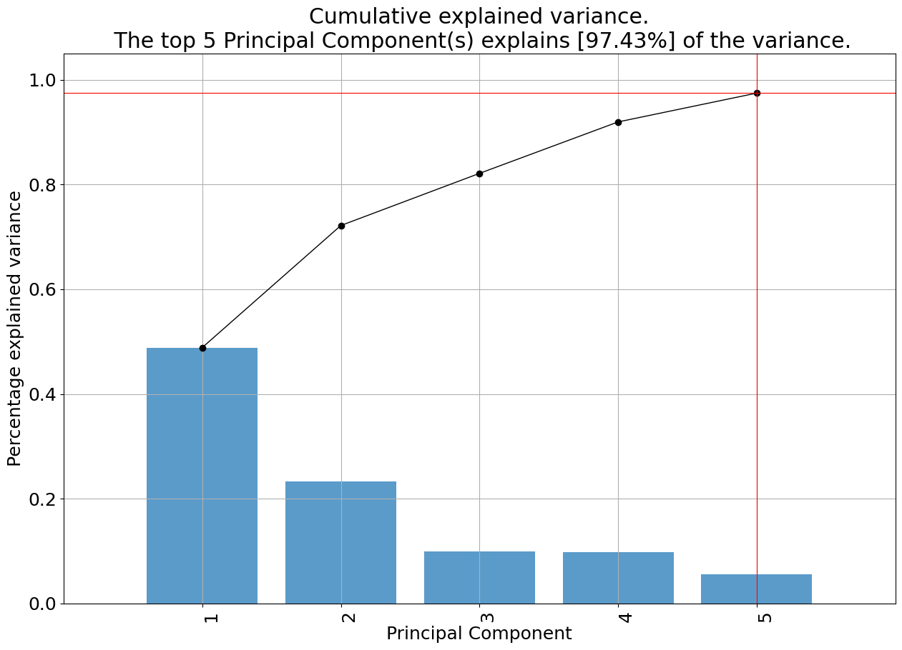
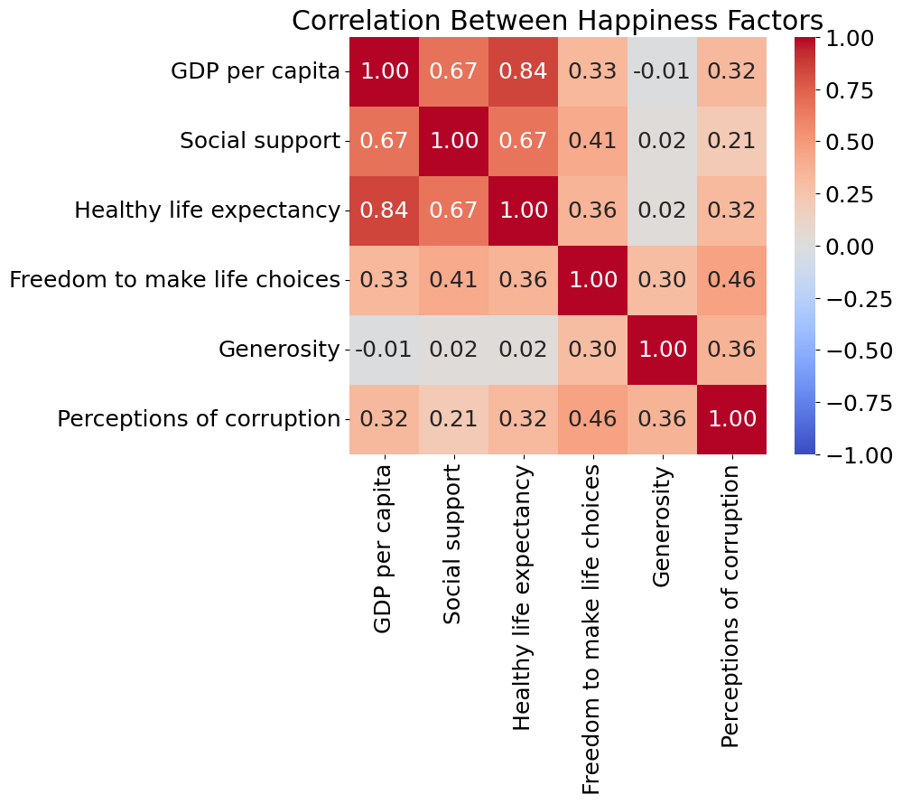
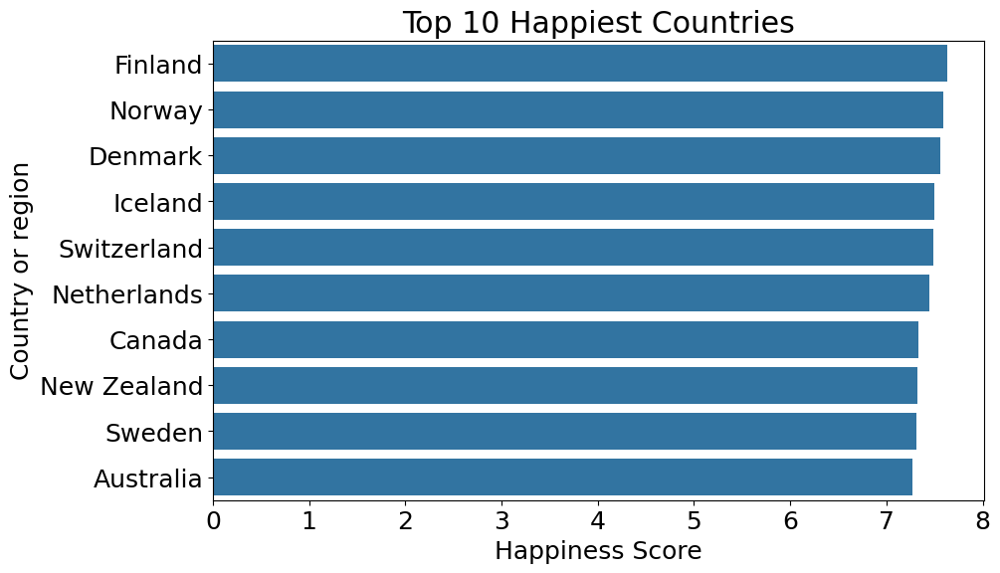

#  Happiness Index Score  Dataset Analysis Project Report 

## 0. Authors of the report

| Name | Contribution |
|------|--------------|
| Shreyas Krishnamurthy     | Supporting the analysis & the report  |
| Daniel Lichtmannecker     |  Creating the Report and interpreting the results |
|  Tobias Demming    |  Supporting the analysis & the report  |
| Ranjit Singh     | Performing the PCA, Creating the Visualizations     |

## 1. Dataset Overview

Numbers refer to the cleaned version of the dataset used for the PCA

| Item                | Description                                                                                                                                                                   |
|---------------------|-------------------------------------------------------------------------------------------------------------------------------------------------------------------------------|
| Number of rows      | 156                                                                                                                                                                          |
| Number of columns   | 7                                                                                                                                                                          |
| Format file (.csv, .txt, etc) | .csv                                                                                                                                                                        |
| Creator of the dataset | Same as the authors of the report                                                                                                                                             |
| Source (name)       | Group1_happiness_Score                                                                                                                                                                |
| Source (link)       | [Final Dataset: Group1_happiness.csv](https://github.com/Titaniel3/ASDA_2025_Group_1_Portfolio_new/blob/main/datasets/happy.csv) 
| Date/Time | 24.12.2025/ 02.03 pm                                                                                                  

## 2. Dataset Structure & Descriptive Statistics

| Feature / Variable               | Data type | Number of unique values | Example values              | Count | Mean     | Std      | Min  | 25%     | 50%     | 75%     | Max    | Variance |
|----------------------------------|-----------|-------------------------|-----------------------------|-------|----------|----------|------|---------|---------|---------|--------|----------|
| Overall rank                     | int64     | 156                     | [1, 2, 3]                   | 156.0 | 78.50000 | 45.17743 | 1.0  | 39.7500 | 78.5000 | 117.250 | 156.0  | 2041.000 |
| Country or region                | object    | 156                     | [Finland, Norway, Denmark]  |       |          |          |      |         |         |         |        |          |
| Score                            | float64   | 154                     | [7.632, 7.594, 7.555]       | 156.0 | 5.37592  | 1.11951  | 2.905| 4.45375 | 5.37800 | 6.16850 | 7.632  | 1.25329 |
| GDP per capita                   | float64   | 147                     | [1.305, 1.456, 1.351]       | 156.0 | 0.89145  | 0.39192  | 0.000| 0.61625 | 0.94950 | 1.19775 | 2.096  | 0.15360 |
| Social support                   | float64   | 146                     | [1.592, 1.582, 1.59]        | 156.0 | 1.21324  | 0.30237  | 0.000| 1.06675 | 1.25500 | 1.46300 | 1.644  | 0.09143 |
| Healthy life expectancy          | float64   | 143                     | [0.874, 0.861, 0.868]       | 156.0 | 0.59735  | 0.24758  | 0.000| 0.42225 | 0.64400 | 0.77725 | 1.030  | 0.06130 |
| Freedom to make life choices     | float64   | 136                     | [0.681, 0.686, 0.683]       | 156.0 | 0.45451  | 0.16242  | 0.000| 0.35600 | 0.48700 | 0.57850 | 0.724  | 0.02638 |
| Generosity                       | float64   | 122                     | [0.202, 0.286, 0.284]       | 156.0 | 0.18101  | 0.09847  | 0.000| 0.10950 | 0.17400 | 0.23900 | 0.598  | 0.00970 |
| Perceptions of corruption        | float64   | 111                     | [0.393, 0.34, 0.408]        | 156.0 | 0.11245  | 0.09634  | 0.000| 0.05100 | 0.08200 | 0.13900 | 0.457  | 0.00928 |

## 3. Results of the PCA of Global Happiness Indicators

Principal Component Analysis (PCA) is a method that reduces complex datasets into a small number of underlying dimensions that summarize the main patterns in the data. In the PCA plot, each point represents a country, while the arrows indicate how strongly different happiness-related factors shape these dimensions.

Principal Component 1 (PC1) is primarily driven by healthy life expectancy and GDP per capita, with additional contributions from social support. This component can be interpreted as a “Material and Health Well-Being” dimension. Countries scoring high on PC1 tend to combine economic prosperity with good health outcomes and strong social systems. In practical terms, PC1 separates countries with broadly favorable living conditions from those facing fundamental economic and health-related challenges.

Principal Component 2 (PC2) is dominated by generosity, and is closely related to freedom to make life choices and perceptions of corruption. This component reflects an “Institutional and Social Quality” dimension, capturing aspects of trust, civic culture, and individual autonomy that are not purely economic. Countries can score relatively high on PC2 even if their income levels are moderate, indicating that governance and social norms play an independent role in shaping well-being.

The table shows which original variables contribute most strongly to each principal component. Healthy life expectancy dominates the first component, while generosity, freedom to make life choices, perceptions of corruption, and social support are most influential in subsequent components, indicating that global happiness is shaped by both material conditions and institutional as well as social factors.

Taken together, the five top PCs explain almost all of the variance in the dataset. 

## 4. Further Interpretation of the Results

The correlation matrix shows that GDP per capita, healthy life expectancy, and social support are closely linked, meaning that wealth, health, and social security often go hand in hand. Generosity, on the other hand, is only weakly connected to these factors, suggesting that social attitudes and values capture a different aspect of happiness that is not directly driven by economic conditions.

For policymakers, this means that improving income and health systems is important, but fostering trust, social values, and supportive institutions requires targeted policies that go beyond purely economic measures

The ranking of the top 10 happiest countries shows a strong concentration in Northern and Western Europe, with countries such as Finland, Denmark, Norway, and Switzerland consistently achieving very high happiness scores. These countries tend to combine high living standards, strong social support systems, good health outcomes, and high levels of institutional trust.

The global map based on the PCA clusters highlights clear regional patterns. High-happiness countries are predominantly found in Europe, North America, and Oceania, while many countries in Sub-Saharan Africa and parts of South Asia fall into the low-happiness cluster. Regions with medium happiness scores, such as Latin America and Eastern Europe, often display mixed profiles, combining moderate economic conditions with varying levels of institutional quality and social cohesion.

**Policy implications**

For policymakers, these patterns suggest that sustained happiness is closely linked to long-term investments in health, social protection, and trustworthy institutions. At the same time, the presence of medium-happiness regions indicates that targeted improvements in governance, social inclusion, and opportunity can yield substantial well-being gains even without reaching the income levels of the highest-ranking countries.