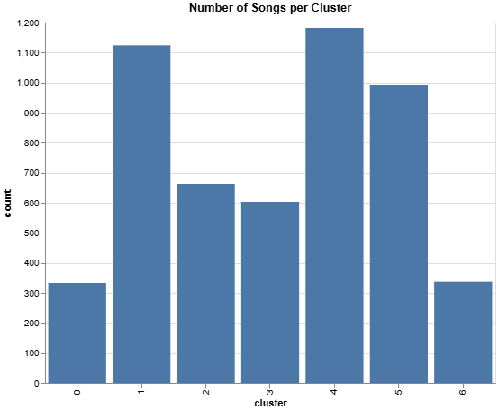
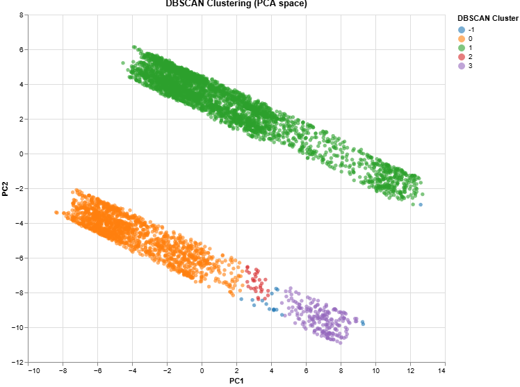
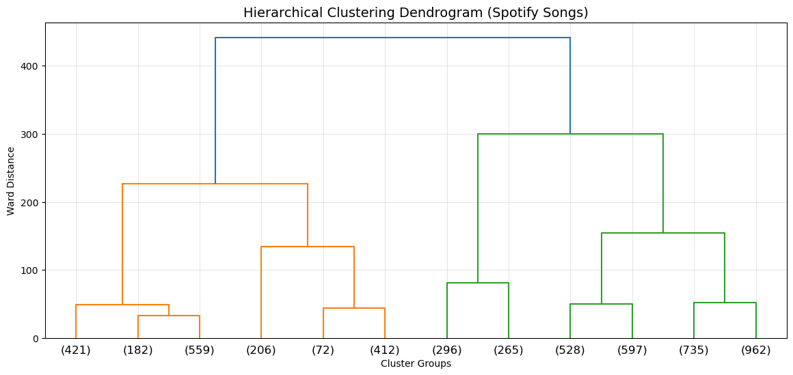
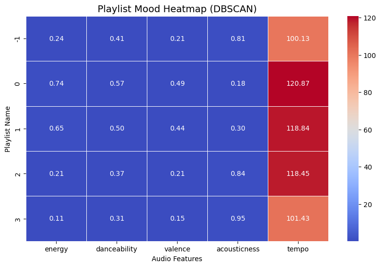
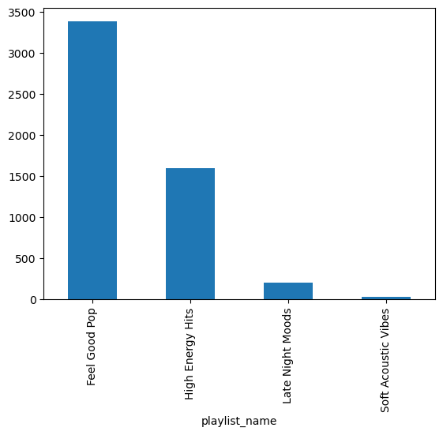

#  Spotify 5000 songs Dataset Analysis Project Report 

## 0. Authors of the report

| Name | Contribution |
|------|--------------|
| Shreyas Krishnamurthy     |  |
| Daniel Lichtmannecker     |  Creating the Spotify playlists, creating the report |
|  Tobias Demming    |   Performing the clustering analysis |
| Ranjit Singh     | Performing the clustering analysis |

## 1. Dataset Overview

Numbers refer to the final version of the dataset used for creating the playlists on Spotify.

| Item                | Description                                                                                                                                                                   |
|---------------------|-------------------------------------------------------------------------------------------------------------------------------------------------------------------------------|
| Number of rows      | 5235                                                                                                                                                                         |
| Number of columns   |  75                                                                                                                                                                         |
| Format file (.csv, .txt, etc) | .csv                                                                                                                                                                        |
| Creator of the dataset | Same as the authors of the report                                                                                                                                             |
| Source (name)       | spotify_playlist_for_class.csv                                                                                                                                                                |
| Source (link)       | [Final Dataset](../datasets/spotify_playlists_for_class.csv) 
| Date/Time | 12.01.2026/ 11.20 am       

## 2. Dataset Structure & Descriptive Statistics

| Column          | Data type | Number of unique values | Example values |
|-----------------|-----------|-------------------------|----------------|
| name            | object    | 5011                    | Ravel: Boléro, M 81                                                                                                              |
| artist          | object    | 2176                    | Maurice Ravel                                   
| html            | object    | 5171                    | https://open.spotify.com/track/3HoO8VUfyXwkgqwaIrVM7u |
| dbscan_cluster  | int64     | 5                       | 1, 0, 3 |
| playlist_name   | object    | 4                       | Feel Good Pop, High Energy Hits, Late Night Moods |

## 3. Cluster Analysis

For clusterin the songs in different playlists we used two different approaches. First, we used K-Means Clustering and later a DBSCAN clustering.

### 3.1. K-Means Clustering

With this method, we received seven different clusters, which differed for the musical variables. The differences between clusters are more striking for some variables (f.e. "energy") than for other variables (f.e. "tempo"). 

This plot shows how the different clusters are located inside a PCA space. PCA1 and PCA2 explain 54.1% of the variance.

Here one can see how many songs are in each cluster when using the K-Means method.

This plot shows how the clusters differ with regard to the musical variables.

### 3.2. DBSCAN Clustering

Even though we liked the results of the K-Means clustering, we decided to also try the DBSCAN method, as this not only allows for circular clustering, but also other shapes. We thought this to be more fitting for different musical variables.

The DBSCAN method only got us four different clusters, with some songs ("-1") being in no cluster. 

This dendogram shows how the hierarchical clustering of the songs into multiple groups in different steps.

We used this heatmap to assign names to the different clusters. We translated the different musical variables into names for the final playlists.

These were the final names of the playlists. The DBSCAN method identified two dominant clusters inside the dataset, in which most of the songs fall. We filtered out the songs which did not belong in any of the clusters.

## 4. Links to the different playlists

Here are the links to the different playlists. We put a random sample of 50 songs in each playlist to get a understanding what type of songs are in each playlist. As there are only 30 songs in the cluster "Soft Acoustic Vibes", we put every song of the cluster in the playlist.

Feel Good Pop: https://open.spotify.com/playlist/3CNIYQS8IqkH5fUtd8mw10?si=698ccfa81f764218&pt=bf06afd809c221bd91e86d65e7658d15

High Energy Hits: https://open.spotify.com/playlist/6QJoXrUKkk6qc2TASayCzT?si=829f8d3c7fc442d4&pt=54751631b82200fb2d0ecee3fab9f8f4

Late Night Moods: https://open.spotify.com/playlist/3GnRwP8ueBR5QDTr2oP5FZ?si=f688cb5c5cfb4f00&pt=268f2bb27b8ab0ccc5db58d418513d9e

Soft Acoustic Vibes: https://open.spotify.com/playlist/3yPWfPGopc2ZkoJDRQwlkI?si=f887b4302ae84a1d&pt=e38c99f932b563383a4b5d3e97e8ea47

## 5. AI Disclaimer

We used AI to create the covers for the spotify playlists.