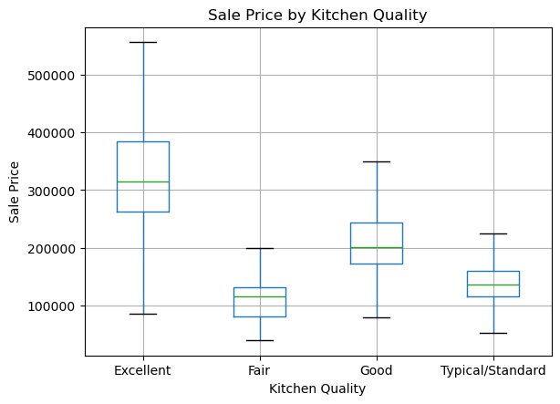
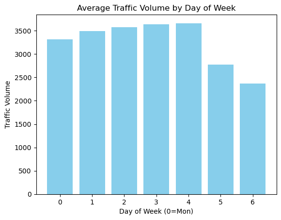
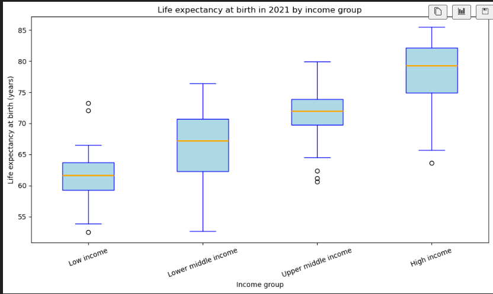
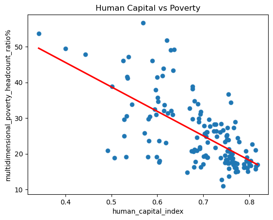
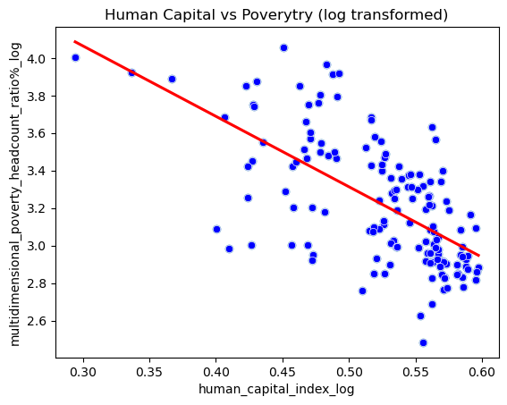
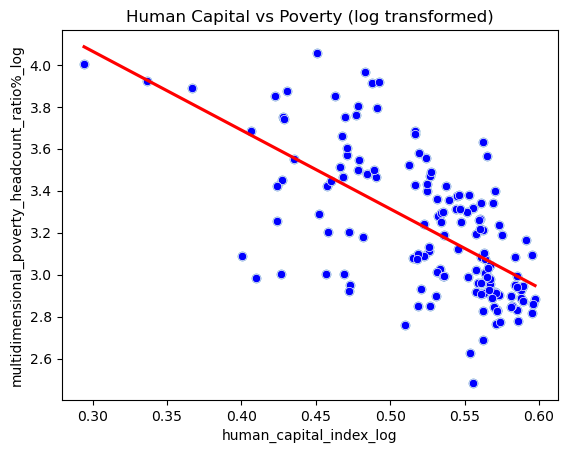
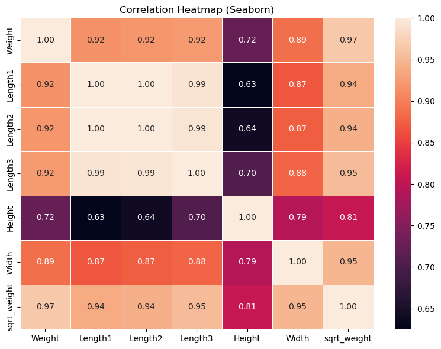

#  Wine Color Classification Analysis Project Report 

## 0. Authors of the report

| Name | Contribution |
|------|--------------|
| Shreyas Krishnamurthy     |  |
| Daniel Lichtmannecker     |   |
|  Tobias Demming    |    |
| Ranjit Singh     | |

## 1. Dataset Overview

| Item                | Description                                                                                                                                                                   |
|---------------------|-------------------------------------------------------------------------------------------------------------------------------------------------------------------------------|
| Number of rows      | 4157                                                                                                                                                                        |
| Number of columns   |     13                                                                                                                                                                     |
| Format file (.csv, .txt, etc) | .csv                                                                                                                                                                        |
| Creator of the dataset | Same as the authors of the report                                                                                                                                             |
| Source (name)       | wine_development(in).csv                                                                                                                                                                |
| Source (link)       | [Final Dataset](../datasets/wine_development(in).csv) 
| Date/Time | 12.01.2026/ 11.20 am   

## 2. Dataset Structure & Descriptive Statistics

| Data type | Variable | Number of unique values | Count | Mean | Std | Min | 25% | 50% | 75% | Max |
|----------|----------|-------------------------|-------|------|-----|-----|-----|-----|-----|-----|
| float64 | fixed acidity | 103 | 4157 | 7.208 | 1.298 | 3.9 | 6.4 | 7.0 | 7.7 | 15.9 |
| float64 | volatile acidity | 173 | 4157 | 0.339 | 0.166 | 0.08 | 0.23 | 0.29 | 0.40 | 1.58 |
| float64 | citric acid | 87 | 4157 | 0.319 | 0.144 | 0.00 | 0.25 | 0.31 | 0.39 | 1.66 |
| float64 | residual sugar | 288 | 4157 | 5.400 | 4.733 | 0.6 | 1.8 | 3.0 | 8.1 | 65.8 |
| float64 | chlorides | 183 | 4157 | 0.056 | 0.035 | 0.012 | 0.038 | 0.047 | 0.065 | 0.611 |
| float64 | free sulfur dioxide | 121 | 4157 | 30.416 | 17.992 | 1.0 | 17.0 | 29.0 | 41.0 | 289.0 |
| float64 | total sulfur dioxide | 264 | 4157 | 115.485 | 56.850 | 6.0 | 77.0 | 118.0 | 155.0 | 440.0 |
| float64 | density | 876 | 4157 | 0.9947 | 0.0030 | 0.9871 | 0.9923 | 0.9948 | 0.9969 | 1.0390 |
| float64 | pH | 100 | 4157 | 3.220 | 0.160 | 2.74 | 3.11 | 3.21 | 3.32 | 3.90 |
| float64 | sulphates | 100 | 4157 | 0.530 | 0.146 | 0.22 | 0.43 | 0.51 | 0.60 | 1.95 |
| float64 | alcohol | 100 | 4157 | 10.491 | 1.193 | 8.0 | 9.5 | 10.3 | 11.3 | 14.9 |
| int64 | quality | 7 | 4157 | 5.822 | 0.882 | 3 | 5 | 6 | 6 | 9 |
| object | color | 2 |  |  |  |  |  |  |  |  |

## 3. SVM Models

For our analysis we decided to test three different support vector machines (SVM), namely a **linear SVM, a radial basis function SVM and a polynomial SVM**. 

Each model we first trained on the training data, evaluated it against a test sample and finally tested its performance against an unseen dataset.

We performed a PCA analysis to see how well the data can be seperated. The PCA shows that with only two Principal Components there form two really visible clusters that can already be seperated quite well. We therefore already expected all three models to perform quite well. 

### 3.1 Null Model

The null model was simply built by always classifying with "white" for the colour, as 74% of the wines had that value. Therefore, **74% accuracy** is the base line for each model

This plot shows the distribution of wine colour in the data set. Approximately 74% of the wines are white wines.

This confusion matrix shows that the null model correctly identifies all the white wines but missclasifies all of the red wines.

### 3.2 Linear SVM

This is the confusion matrix of the (optimized) linear SVM model.

### 3.3 RBF SVM

This is the confusion matrix of the (optimized) RBF SVM model.

### 3.4 Polynomial SVM

 

 This is the confusion matrix of the (optimized) polynomial SVM model.

### 3.5 Evaluation of the different models

All of the models worked really well and fitted the data properly. We now evaluated the different models to determine the best one. 

| Metric / Parameter        | Linear SVM | RBF SVM | Polynomial SVM |
|---------------------------|------------|---------|----------------|
| Kernel                    | linear     | rbf     | poly           |
| Mean CV F1-score          | 0.9923     | 0.9939  | 0.9943         |
| Mean CV Accuracy          | 0.9943     | 0.9955  | 0.9958         |
| Mean CV Precision         | 0.9929     | 0.9954  | 0.9960         |
| Mean CV Recall            | 0.9917     | 0.9925  | 0.9927         |
| C                         | 1.0        | 100.0   | 1.0            |
| Gamma                     | –          | 0.01    | scale          |
| Degree                    | –          | –       | 2              |
| Coef0                     | –          | –       | 1.0            |
| Class weight              | None       | balanced| None           |

### 3.6 Testing our final model against the holdout dataset

After deciding for the polynomial SVM model, we tested it against the holdout dataset to see how it performs. 

| Class | Precision | Recall | F1-score | Support |
|-------|-----------|--------|----------|---------|
| red   | 1.00      | 0.98   | 0.99     | 256     |
| white | 0.99      | 1.00   | 1.00     | 784     |
| **Accuracy** |        |        | 1.00 | 1040 |
| **Macro avg** | 1.00 | 0.99 | 0.99 | 1040 |
| **Weighted avg** | 1.00 | 1.00 | 1.00 | 1040 |

This table shows the key figures for evaluating the performance of the polynomial SVM model. 

The confusion matrix shows, that only five wines of the unseen dataset were misclasified, which is pretty decent.

## 4. Bonus Task

## 5. AI Disclaimer

We used AI to assist us with difficult code which we could not figure out ourselve even after extentsive trying. 

